  
*Responsive design of the Home page displayed across multiple devices.*

# Nordstroms VVS

A professional and responsive website for a small plumbing company.

A simple marketing website built for a local plumbing business.  
This user-friendly site allows customers to explore plumbing services and contact the business easily.  
The website is designed with clarity, accessibility, and trust in mind — highlighting the company's local presence and service offerings.  

**Live Site:** [https://gooldenapple.github.io/vvs-nordstrom/](https://gooldenapple.github.io/vvs-nordstrom/)
---

## Contents

- [User Experience (UX)](#user-experience-ux)  
- [Design](#design)
- [Wireframes](#wireframes)  
- [Features](#features)  
- [Accessibility](#accessibility)  
- [Technologies Used](#technologies-used)  
- [Deployment & Local Development](#deployment--local-development)  
- [Testing](#testing)  
- [Credits](#credits)  

---

## User Experience (UX)

### Project Purpose

The purpose of this project is to provide **Nordströms VVS** with a professional and accessible online presence that supports both the company's goals and the needs of its users.  

- **Business goals:** Increase visibility of the company, clearly present offered services, and make it easy for potential customers to get in contact.  
- **User goals:** Quickly understand what the company does, easily find contact information, and view examples of past work for reassurance and trust.  

The website therefore acts as both a **marketing tool** and a **practical communication channel**, ensuring customers can move smoothly from discovering the company to making an inquiry.

### UX Decisions

- The layout is fully responsive, optimized for mobile, tablet, and desktop to ensure a great user experience on all devices.  
- Colour and typography choices focus on readability and accessibility, meeting WCAG contrast standards.  
- Navigation is simple and consistent throughout the site, with clear call-to-action buttons.  

### Initial Discussion

Nordstroms VVS is a trusted local plumbing company offering professional services to homeowners and small businesses. Proudly serving the community, the company emphasizes reliable and friendly customer service.

This website has been developed to provide a clear and user-friendly experience, enabling first-time visitors to quickly understand the range of services offered. The design prioritizes simplicity and accessibility, ensuring that users of all technical levels can navigate the site with ease on any device thanks to its responsive layout.

Returning customers benefit from easy access to up-to-date contact information, while frequent visitors can efficiently submit inquiries or recommendations. Accessibility features are integrated to make the website usable for all, including those with disabilities.

By focusing on clarity and inclusivity, the site builds trust and encourages customer engagement, highlighting the core service areas of Water, Heating, and Sanitation.

### Key Information for the Site

- Clear navigation
- Contact options  
- Access to image gallery    
- Overview of plumbing services

### User Stories

#### Client Goals

**User Story:** 
  As the owner of Nordströms VVS, I want a simple, easy-to-navigate website that clearly presents our services and contact options, so that potential customers can quickly find what they are looking for and reach out to us without hassle.

**Acceptance Criteria:**  
- The website clearly displays all key services offered by the company.  
- Contact information is prominently visible on all pages.  
- The design is clean, straightforward, and user-friendly across all devices.  
- Navigation is intuitive and consistent throughout the site.  
- The site loads quickly and functions smoothly on both desktop and mobile devices.

**Tasks:**  
- Design and implement a clear homepage with service overview and call-to-action.  
- Ensure contact info is included in the header and footer on every page.  
- Apply responsive design principles and test across devices.  
- Create a consistent navigation menu with clear labels.  
- Optimize images and assets for fast loading times.

#### First Time Visitor Goals

**User Story:**  
  As a first-time visitor, I want to easily understand what services the company offers and be able to view past projects, so that I can quickly decide if they fit my needs and trust their expertise.

**Acceptance Criteria:**  
- Services are clearly listed on the homepage and the dedicated Services page.  
- Each service has a brief, easy-to-read description.  
- Clear navigation to the Services page is available from the homepage.  
- A Gallery page is accessible, showcasing past projects with high-quality images.  
- Gallery images have descriptive alt text for accessibility.

**Tasks:**  
- Create a concise services overview section on the homepage.  
- Build a dedicated Services page with detailed descriptions of each service.  
- Add call-to-action buttons linking between the homepage and Services page.  
- Develop a Gallery page displaying past projects with optimized images.  
- Ensure all gallery images include descriptive alt text.  
- Add navigation links to the Gallery page from relevant parts of the site.

#### Returning Visitor Goals

**User Story:**  
As a returning visitor, I want to find up-to-date information on the services offered and be able to quickly contact the company with any questions, so that I can stay informed and communicate easily.

**Acceptance Criteria:**  
- The Services page content is current and accurately reflects all offerings.  
- Contact information is clearly visible and easy to find on all pages.  
- The contact form is functional and user-friendly.  
- Contact links/buttons are accessible from every page.

**Tasks:**  
- Regularly review and update service descriptions on the Services page.  
- Ensure contact details (phone, email, address) are included in header and footer.  
- Maintain and test the contact form to ensure submissions work correctly.  
- Add prominent contact buttons or links throughout the site for quick access.

#### Frequent Visitor Goals

**User Story:**  
As a frequent visitor, I want to be able to submit inquiries or requests efficiently and recommend the company to others, so that I can maintain easy communication and share positive experiences.

**Acceptance Criteria:**  
- The contact form is easy to locate and simple to use on all devices.  
- Required fields are clearly marked and validated to prevent errors.  
- Users receive a confirmation message or are redirected to a thank you page after submission.  
- There is an easy way to share or recommend the company (e.g., social media links or share buttons).  

**Tasks:**  
- Ensure the contact form is accessible from all pages via navigation or footer.  
- Implement client-side validation for required fields in the contact form.  
- Add a confirmation message or automatic redirect to a thank you page after form submission.  
- Add social media share buttons or visible links for easy recommendations.  
- Test form functionality and share options on desktop and mobile.

#### Accessibility Considerations for Older Users

**User Story:**  
As an older user, I want clear and simple navigation without clutter, easy-to-find contact information, and buttons that are large and easy to click, so that I can use the website comfortably and without frustration.

**Acceptance Criteria:**  
- Navigation menus are straightforward, with minimal items and no unnecessary distractions.  
- Contact information (phone, email) is prominently displayed and accessible on all pages.  
- Buttons are sufficiently large, with clear labels and ample spacing for easy clicking.  
- The website uses high-contrast colors to improve readability.  
- Text size is adjustable or large enough for comfortable reading.

**Tasks:**  
- Simplify navigation menus and remove any clutter or overly complex elements.  
- Place contact info in header and footer in clear, easy-to-read format.  
- Style buttons with sufficient size, padding, and clear text labels.  
- Ensure color contrast meets WCAG AA standards.  
- Use relative units (em/rem) for font sizes to support user zooming.

---

## Design

### Colour Scheme

[Color Palette](assets/images/readme/color-palette.png) 

The chosen palette reflects professionalism and trust, inspired by natural copper and earth tones.  
- **Copper/Brown shades** convey warmth and reliability.  
- **White** provides clarity and clean contrast.  
- **Black/Dark tones** enhance readability and accessibility.  

This balance ensures the site is visually appealing while meeting WCAG contrast standards.  

### Typography

The website uses **Arial, sans-serif** for clarity and cross-device compatibility.  
- **Headings** are bold and large to create a strong visual hierarchy.  
- **Body text** is lightweight, easy to read, and optimized with relative units.  

This combination ensures readability, accessibility, and a clean professional look that reflects the company’s identity.  

### Imagery

- **Hero Image:** Flowing copper pipes, symbolizing the core plumbing services.  
- **About Us Image:** Company vehicle photo, representing local presence and professionalism.  
- **Gallery Images:** High-quality examples of completed projects, showcasing craftsmanship.  

All images are optimized for web, compressed for fast loading, and include descriptive `alt` text for accessibility. 

---

## Wireframes

The wireframes below illustrate the planned layout and structure for each page of the Nordstroms VVS website. They were created to guide the design and ensure a user-friendly, responsive experience.

### Home Page

  
📸Home Page wireframe

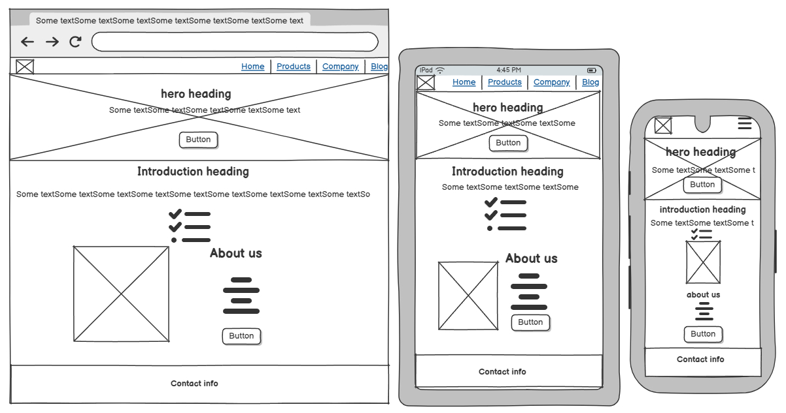
 
*The homepage wireframe shows the hero section, navigation menu, services overview, and footer layout.*

### Services Page

  
📸Services Page wireframe

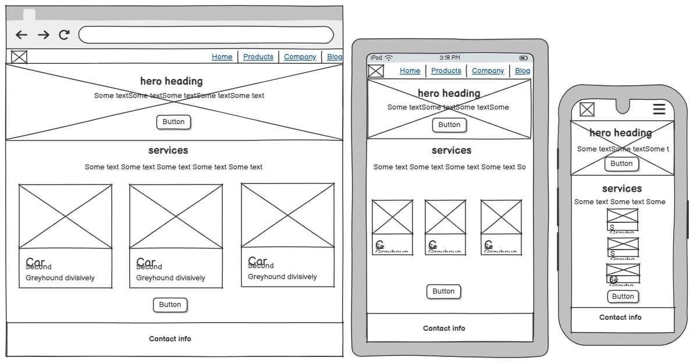 
 
*This wireframe outlines the service categories with icons and descriptions, designed for clarity and easy navigation.*

### Gallery Page

  
📸Services Page wireframe

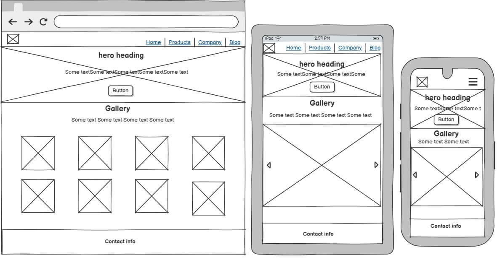
 
*The gallery page wireframe demonstrates a responsive grid layout with a mobile carousel for images.*

### Contact Page

  
📸Contact Page wireframe

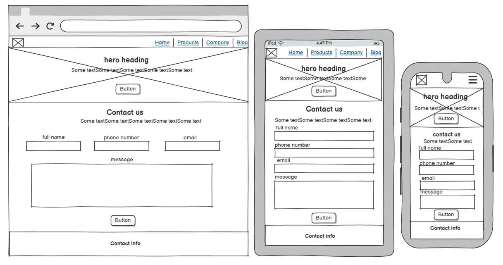
  
*The contact page wireframe highlights the form layout with labeled fields, validation indicators, and submission button.*

### Success Page

  
📸Services Page wireframe

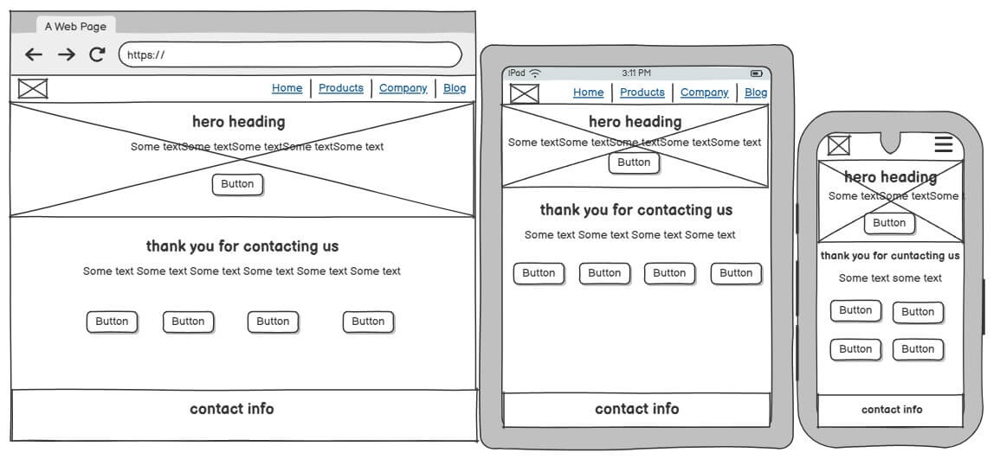 
 
*This wireframe shows the confirmation message displayed after a successful form submission.*

---

## Features

### Page Overview

The website consists of five main pages:

- **Home:**  
  Engaging hero section with a clear call-to-action button directing users to the Services page.  
  Introduction and "About Us" section highlight trust, professionalism, and company values.  

  

  
🏠 Homepage

  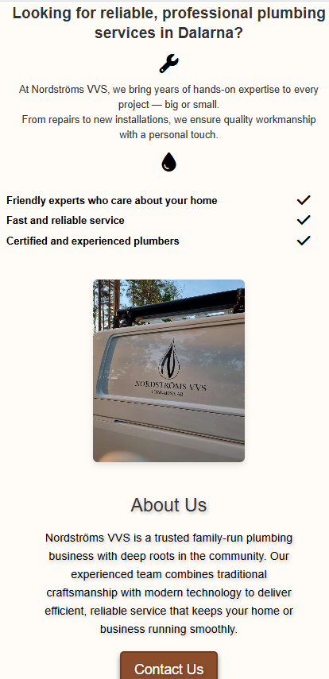
   
   An introduction and about us section highlighting trust and professionalism, and clear call-to-action button leading to contact us page.
  

  

  
🏠 Homepage

  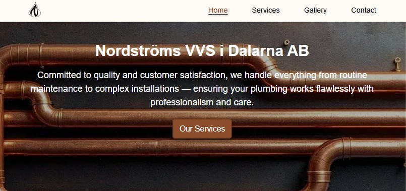   
   
  The homepage introduces the company with a welcoming hero section and clear call-to-action button.
  

- **Services:**  
  Detailed descriptions of plumbing services, divided into three categories: **Water, Heating, and Sanitation**.  
  Each service card includes an icon and short description for clarity. 

  

  
🔧 Services Page

  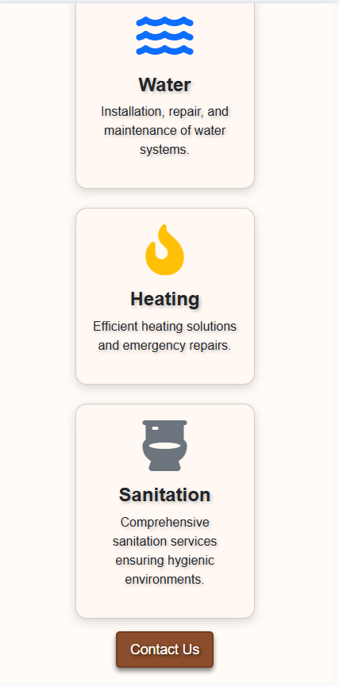  
   
  The services page outlines the three main areas of expertise — Water, Heating, and Sanitation — each with icons and concise descriptions for clarity.  
  

- **Gallery:**  
  Responsive and accessible gallery showcasing completed projects.  
  - Desktop: grid layout with neat spacing.  
  - Mobile/Tablet: carousel for smooth browsing.  
  All images include descriptive `alt` text for accessibility. 

  

  
🖼️ Gallery Page

    
  The gallery showcases completed projects in a responsive grid layout, with optimized images and descriptive alt text.  
  

  

  
🔍 Gallery Lightbox View

    
  Clicking an image opens it in a lightbox view, allowing visitors to browse projects in larger detail with navigation controls.  
  

- **Contact:**    
  User-friendly form with required fields, validation, and clear labels.  
  Includes contact information (phone, email, address) alongside the form.  

  

  
📩 Contact Page

  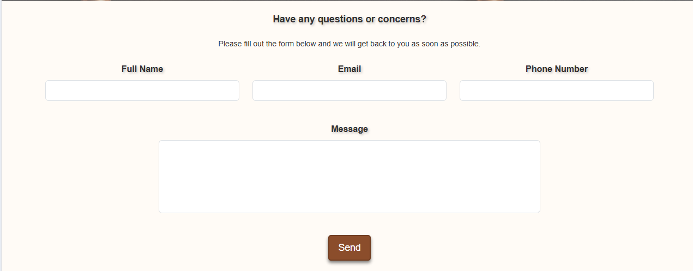  
   
  The contact page includes a simple and accessible form for visitors to submit inquiries, alongside prominently displayed contact information.  
  

- **Success:**  
   Confirmation page shown after form submission, providing reassurance and navigation options back to key pages.

  

  
✅ Success Page

  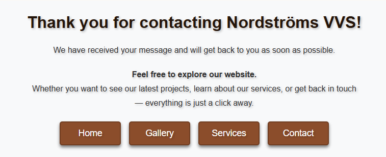  
   
  After submitting the form, users are redirected to a confirmation page thanking them and providing clear navigation back to other site sections.  
  

### General Features on All Pages

- Responsive navigation bar with hamburger menu on mobile.  
- Footer with contact info (phone, email, address, and social links).  
- Favicon present on all pages for brand identity.  
- Uniform styling and consistent color scheme.  
- Semantic HTML5 structure.  
- ARIA attributes and visible focus indicators for keyboard navigation.

### Specific Features

- **Home:**  
  - Hero section with overlay text and CTA to service page.  
  - Introduction and About Us section with CTA to contact page. 

- **Services:**  
  - Three service cards (Water, Heating, Sanitation).  
  - Icons + short descriptions. 
  - CTA to contact page.

- **Gallery:**  
  - Grid layout on desktop, carousel on smaller screens.  
  - Lightbox view for enlarged browsing with navigation arrows.  

- **Contact:**  
  - Simple and accessible form with labels and validation.  
  - Clear call-to-action button with hover/focus styles. 

- **Success:**  
  - Confirmation message after form submission.  
  - Navigation back to main pages. 

## Future Implementations

Planned improvements and features for future versions:  

- **Online Booking System** – direct appointment requests with email notifications.  
- **FAQ Section** – answers to common customer questions.  
- **Blog/News Section** – plumbing tips, updates, SEO boost.  
- **Multi-Language Support** – Swedish + English for wider accessibility.  
- **Expanded Gallery** – categorized by service type.  
- **Customer Testimonials** – static section or live reviews integration.

---

## Accessibility

  Accessibility has been a key focus during the development of this project to ensure that the website is usable by as many people as possible, including those with disabilities and older users.  

- **Semantic HTML5** used for meaningful structure, improving screen reader compatibility.  
- **Descriptive `alt` text** provided for all images, conveying purpose and content.  
- **WCAG AA compliant color contrast**, tested with Lighthouse and WAVE.  
- **Keyboard accessibility** – all interactive elements can be navigated via keyboard, with clear focus indicators.  
- **ARIA attributes** added where necessary to improve assistive technology support.  
- **Form labels** – all input fields have associated labels for clarity.  
- **Relative font sizing (em/rem)** used to allow users to scale text.  
- **Large, clickable buttons and links** with proper spacing, improving usability on touch devices and for users with motor impairments.  

---

## Technologies Used

### Languages

- **HTML5** — used to structure the website content with semantic elements.  
- **CSS3** — used for styling and responsive layout.
- **JavaScript** — used via Bootstrap for responsive navigation and via Lightbox for the interactive gallery.

### Frameworks and Libraries

- **Bootstrap 5** — for responsive layout and UI components, including the navbar and grid system.  
- **Font Awesome** — for scalable vector icons and social media logos.

### Tools and Services

- **Visual Studio Code** — primary code editor, with extensions for HTML, CSS, and Git integration.  
- **Git & GitHub** — for version control, repository hosting, and deployment via GitHub Pages.  
- **GitHub Pages** — hosting the live website.  
- **Google Fonts** — web-optimized typography (Arial fallback).  
- **TinyPNG** — image compression and optimization for performance.  
- **Squoosh** — for image optimization and compression.  
- **AmiResponsive** — created responsive mockup previews for documentation.  
- **Balsamiq** — wireframing tool for page structure planning.  
- **Chrome DevTools / Browser DevTools** — for debugging, layout inspection, and performance tuning.  
- **Adobe Photoshop** — image editing and optimization.  
- **Lighthouse** — Performance, accessibility, SEO, and best practices audits.  
- **Favicon** — custom site icon used to reinforce brand identity in browser tabs and bookmarks.
- **ChatGPT (OpenAI)** — Assistanted with code review, documentation and text.
- **Diffchecker** — used for text comparison and version tracking.

---

## Project Management

To keep track of development progress and tasks, a GitHub Project Board was used.  
Below is a snapshot of the current board showing the different columns for Todo, In Progress, and Done tasks, including completed user stories and accessibility considerations.

 Project Board Screenshot

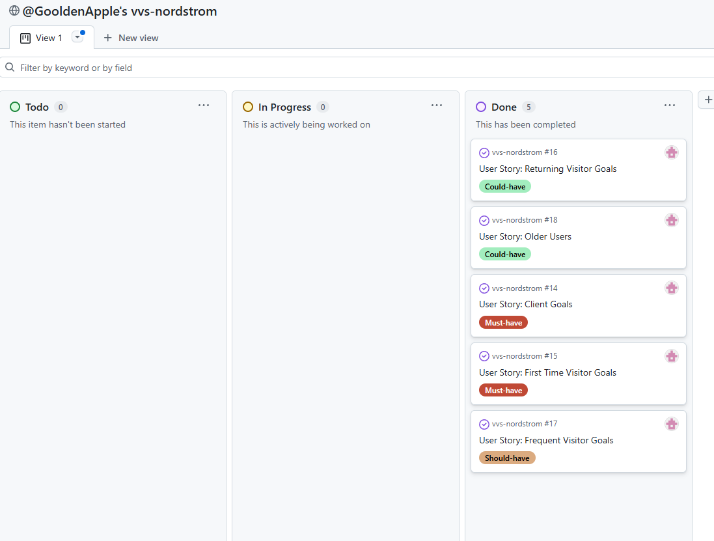
 
*The project board helped organize and prioritize tasks efficiently.*

---

## Mockups

Responsive mockups of the website were created to visualize how the design adapts across devices (desktop, tablet, and mobile).  
This provided a clear preview of the user experience before and after deployment.  

The mockups were generated using the [TechSini Multi Device Mockup Generator](https://techsini.com/multi-mockup/).

---

## Deployment & Local Development

### GitHub Pages Deployment

This website is hosted using **GitHub Pages**.  
The live site can be accessed at:  
[https://gooldenapple.github.io/vvs-nordstrom/](https://gooldenapple.github.io/vvs-nordstrom/)  

### Deployment Steps  

1. Created a new repository on GitHub for the project.  
2. Cloned the repository locally and developed the project using **Visual Studio Code**.  
3. Committed and pushed changes to the `main` branch on GitHub.  
4. In the GitHub repository, navigated to **Settings** > **Pages**.  
5. Set the publishing source to the `main` branch and root folder.  
6. Saved settings, allowing GitHub Pages to automatically publish the site.  
7. The live site is available via the provided GitHub Pages URL.

### Additional Deployment Details

- The `main` branch serves as the production branch.  
- Any commit pushed to `main` automatically redeploys the site.  
- A custom domain can be added in the future via GitHub Pages settings.  
- If GitHub Pages is unavailable, the project can be run locally.  

### Local Development

To work on the project locally:

1. **Clone the repo**  
`git clone https://github.com/gooldenapple/vvs-nordstrom.git`  
This command downloads the entire project from GitHub to your computer, giving you a local copy to work on.

2. **Open the project folder in your code editor**  
For example, Visual Studio Code, where you can edit HTML, CSS, and other files.

3. **Make changes and test locally**  
You can open HTML files directly in your browser or use a local development tool (like Live Server in VS Code) to see changes in real time.

4. **Commit and push**  
When you have made changes, you save them ("commit") and send them up to GitHub ("push") so the online version stays updated.

---

## Testing

Testing was conducted throughout the development process using both manual and automated methods to ensure functionality, responsiveness, and accessibility. Below are the results from validator tools, Lighthouse audits, manual feature testing, and user story testing.

---

### Browser Testing

The website was tested on multiple browsers and devices to ensure consistent performance and user experience. Testing was conducted on:

- **Google Chrome**  
- **Microsoft Edge**  
- **Mozilla Firefox**  
- **Mobile/tablet device**
- **safari**

✅ The site performed consistently across all browsers.  
⚠️ A minor issue in Microsoft Edge (contact form alignment) was identified and fixed.

---

### Accessibility Testing

Accessibility was validated both manually and with automated tools:

- **Automated Testing:**  
  - Lighthouse accessibility audits consistently returned a score of 100.  
  - WAVE Web Accessibility Evaluation Tool showed no critical issues.  

- **Manual Testing:**  
  - All images include descriptive `alt` attributes.  
  - Headings (`h1–h6`) follow a logical order for screen readers.  
  - Color contrast meets **WCAG 2.1 AA** standards  
  - All interactive elements (buttons, links, form inputs) are reachable and operable using only the keyboard.  
  - Focus indicators are visible and clear when tabbing through the site.    

These tests confirm that the site meets WCAG 2.1 AA standards for accessibility.

---

### Automated Testing & Tools

- **W3C HTML Validator** — confirmed valid, semantic HTML after fixes.  
- **W3C CSS Validator** — passed with no errors.  
- **Lighthouse Audits** — tested for performance, accessibility, SEO, and best practices.  
- **WebAIM Contrast Checker** — ensured proper color contrast.  
- **Chrome DevTools** — used for debugging, performance checks, and responsive testing. 

---

### Code Validation

- **CSS Validation:**  
  The stylesheet passed the [W3C CSS Validation Service](https://jigsaw.w3.org/css-validator/) with no errors, confirming compliance with CSS3 standards.

Css validation screenshot

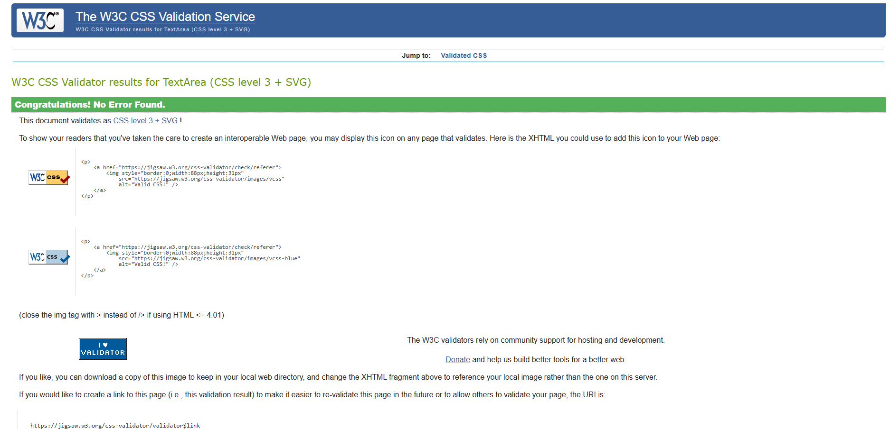 
  
*Screenshot from the W3C CSS Validator showing no errors, confirming CSS compliance.*

 

- **HTML Validation:**  
  All HTML files were validated with [W3C Markup Validation Service](https://validator.w3.org/).  
  - Fixed invalid file paths containing spaces.  
  - Replaced backslashes (`\`) with forward slashes (`/`).  
  - Added missing `alt` attributes.  
  - Corrected stray/missing end tags.

 

Home Page HTML validation Screenshot before

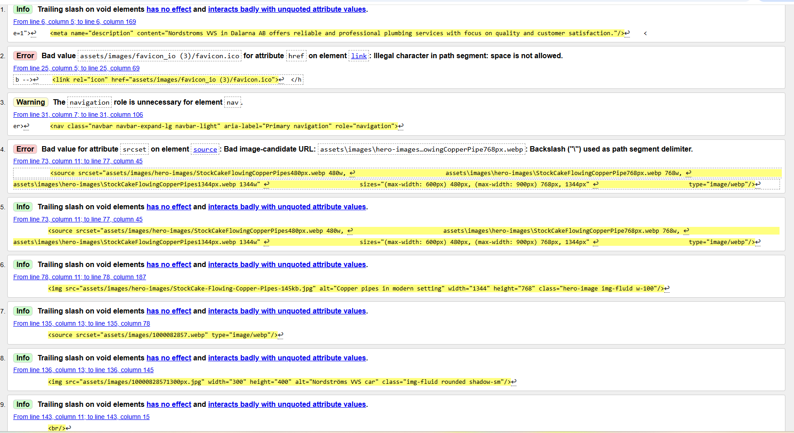 
 
*Screenshot showing the results from the W3C HTML Validator, indicating validation errors and warnings.*

Home Page HTML validation Screenshot after

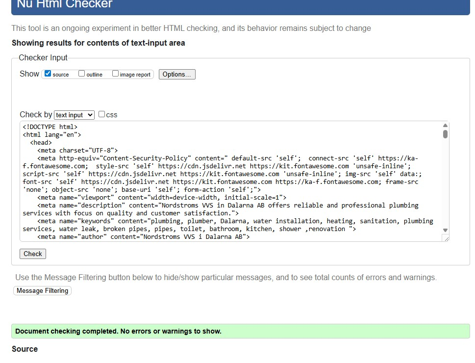
 
*Screenshot showing the results from the W3C HTML Validator after fixing bugs.*

Service Page HTML validation Screenshot before

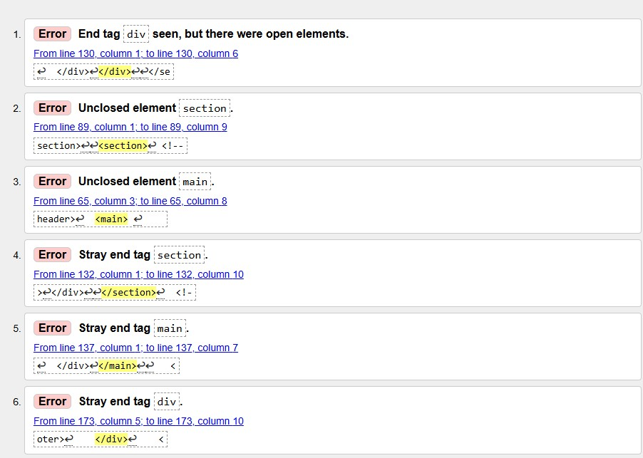
 
*Screenshot showing the results from the W3C HTML Validator, indicating validation errors and warnings.*

Service Page HTML validation Screenshot after

 
*Screenshot showing the results from the W3C HTML Validator after fixing bugs.*

contact Page HTML validation Screenshot

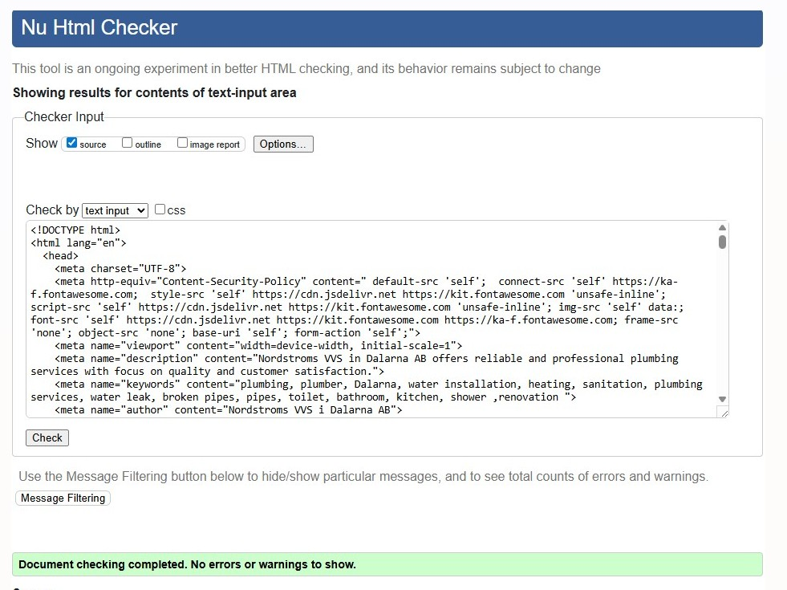
 
*Screenshot showing the results from the W3C HTML Validator, showing no errors.*

Success Page HTML validation Screenshot

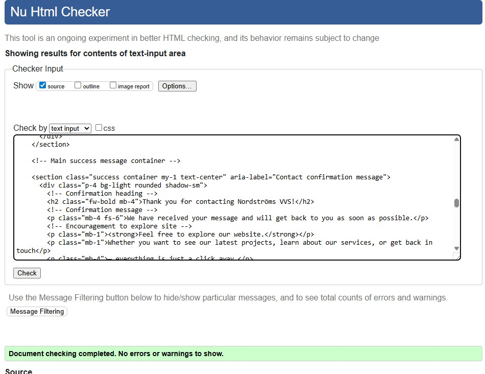
 
*Screenshot showing the results from the W3C HTML Validator, showing no errors.*

Gallery Page HTML validation Screenshot

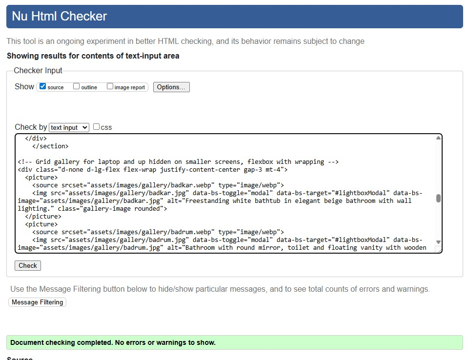
 
*Screenshot showing the results from the W3C HTML Validator, showing no errors.*

---

### Lighthouse Testing

- Conducted on both desktop and mobile, scores have improved to a performance range of 90–100.  
- Accessibility scores consistently at 100, reflecting good semantic structure and ARIA usage.  
- SEO scores at 100, indicating good metadata and mobile-friendliness.  
- Best Practices scores around 81–82, with a warning for deprecated APIs and caching policies.  
- Largest Contentful Paint (LCP) improved but can be optimized further.  
- Cumulative Layout Shift (CLS) issues resolved by defining explicit image dimensions and stabilizing hero/navigation elements. 

## Lighthouse Audit Results

Home Page Screenshot

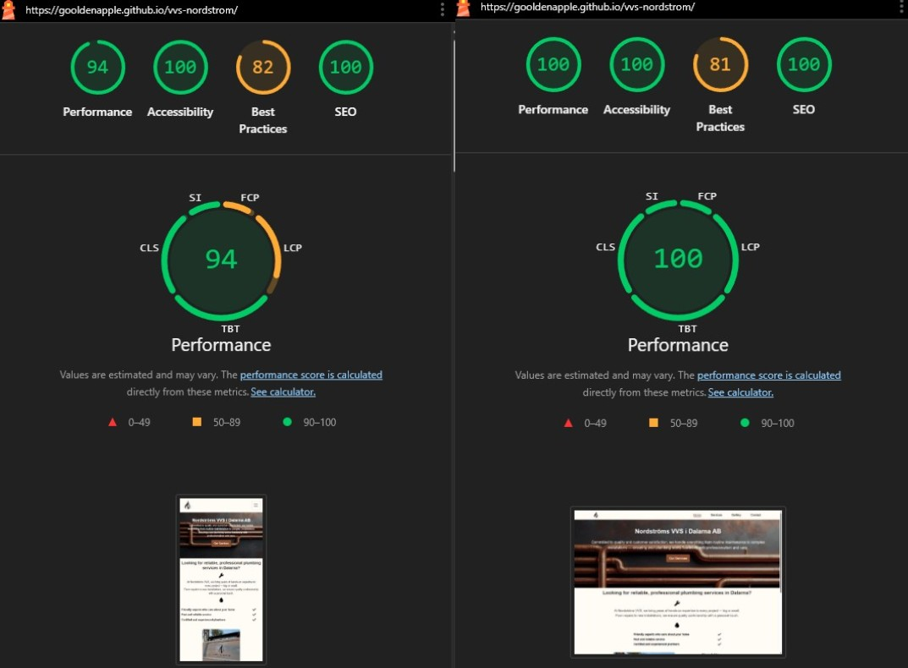 
 
*Screenshots of mobile and desktop lighthouse scores, improved performance after image optimization, caching fixes, and CSS minification.*

Service Page Screenshot

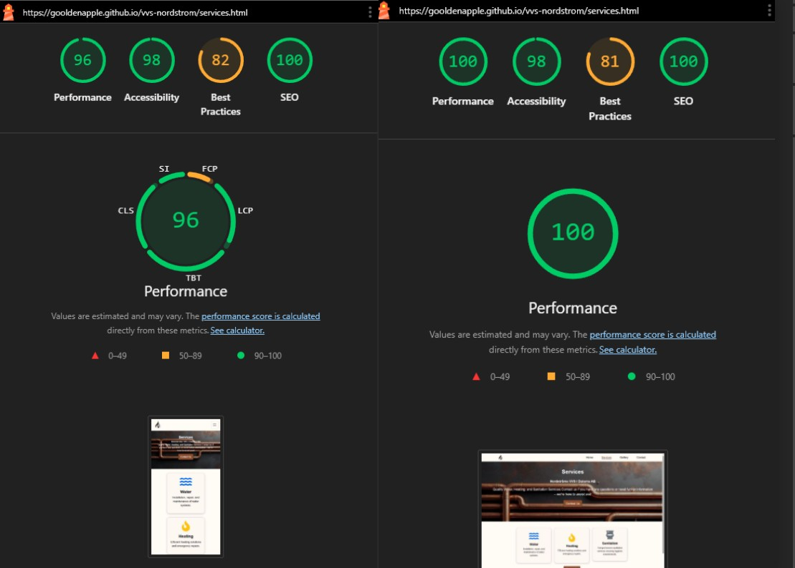 
 
*Screenshots of mobile and desktop lighthouse scores, improved performance after image optimization, caching fixes, and CSS minification.*

Contact Page Screenshot

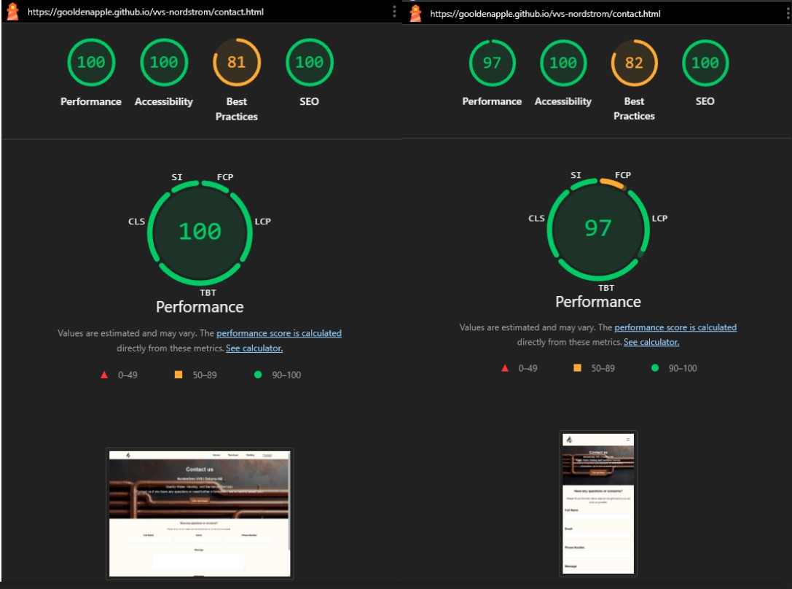
 
*Screenshots of mobile and desktop lighthouse scores, improved performance after image optimization, caching fixes, and CSS minification.*

Success Page Screenshot

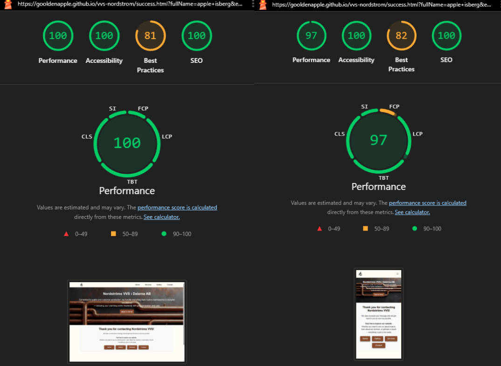
 
*Screenshots of mobile and desktop lighthouse scores, improved performance after image optimization, caching fixes, and CSS minification.*

Gallery Page Screenshot

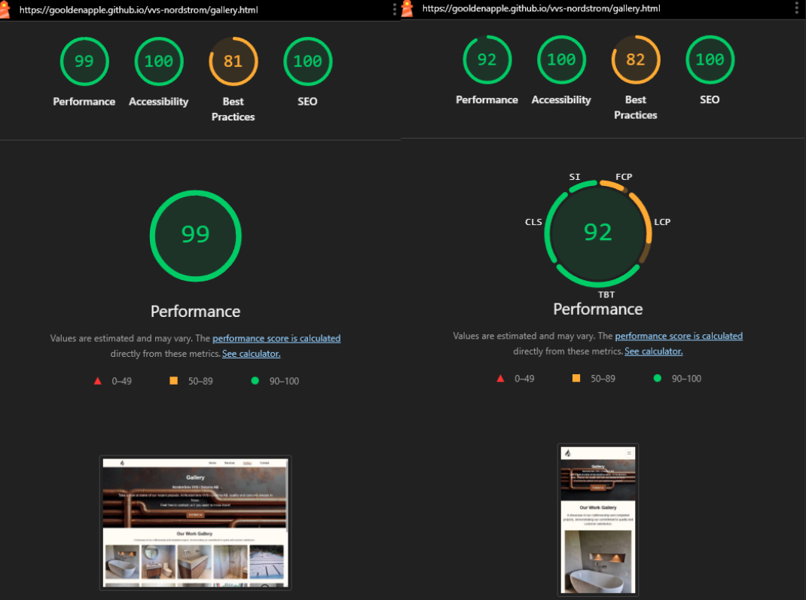 
 
*Screenshots of mobile and desktop lighthouse scores, improved performance after image optimization, caching fixes, and CSS minification.*

---

### Manual Testing 

- The website was tested on various devices and screen sizes (desktop, tablet, mobile) to ensure responsive design and consistent layout.  
- All navigation links and buttons were checked to confirm they function correctly on every page.  
- The contact form was tested for required field validation, successful submission flow and including redirection to the success page.  
- The image gallery was tested for proper loading, accessibility (alt text), and responsiveness, including carousel functionality on smaller devices.  
- Images and media files were verified for correct display and optimization to maintain fast load times.  
- Accessibility features were manually tested, including keyboard navigation and focus indicators.

### Manual Testing of Key Features

| Feature              | Expected                 | Action                | Result                        | Status |
|----------------------|--------------------------|-----------------------|-------------------------------|--------|
| **Navbar**           | Collapse on mobile       | Resize browser        | Hamburger works correctly     | ✅ |
| **Hero CTA Button**  | Go to Services page      | Click "Our Services"  | Redirects to `services.html`  | ✅ |
| **Gallery Lightbox** | Open image + arrows      | Click gallery item    | Lightbox opens, arrows work   | ✅ |
| **Contact Form**     | Validation & redirect    | Submit empty/valid    | Errors handled, redirect OK   | ✅ |
| **Footer Links**     | Open new tab/app         | Click links           | Open as expected              | ✅ |
| **Responsive Layout**| Adapt to screen sizes    | Test across devices   | Works on desktop/tablet/mobile| ✅ |

----

## User Story Testing

### Client Goals — Simple and user-friendly website

| Expected | Action | Result | Status |
|----------|--------|--------|--------|
| Services visible | Visit homepage/services | Clear overview & details | ✅ |
| Contact info visible | Inspect header/footer | Always shown | ✅ |
| Responsive design | Test on devices | Layout adapts | ✅ |
| Intuitive navigation | Use navbar | Consistent | ✅ |
| Fast load times | Run Lighthouse | Optimized | ✅ |

---

### First Time Visitor Goals — Understand services & view past projects

| Expected | Action | Result | Status |
|----------|--------|--------|--------|
| Services clear | Visit `services.html` | Water/Heating/Sanitation listed | ✅ |
| Gallery visible | Go to `gallery.html` | Grid loads with alt text | ✅ |
| CTA works | Click homepage button | Redirect to `services.html` | ✅ |

---

### Returning Visitor Goals — Up-to-date info & quick contact

| Expected | Action | Result | Status |
|----------|--------|--------|--------|
| Up-to-date services | Check `services.html` | Accurate | ✅ |
| Easy contact | Use form/footer | Visible & working | ✅ |
| Contact form functional | Submit test entry | Redirect to success page | ✅ |

---

### Frequent Visitor Goals — Efficient inquiries & sharing

| Expected | Action | Result | Status |
|----------|--------|--------|--------|
| Quick access to form | Check nav/footer | Accessible | ✅ |
| Validation works | Submit incomplete form | Error displayed | ✅ |
| Confirmation after form | Submit valid form | Redirect to `success.html` | ✅ |
| Easy sharing | Use footer links | Social/contact visible | ✅ |

---

### Accessibility — Older Users

| Expected | Action | Result | Status |
|----------|--------|--------|--------|
| Simple navigation | Inspect navbar | Uncluttered | ✅ |
| Prominent contact info | Check footer | Always visible | ✅ |
| Large, easy buttons | Test on mobile | clickable | ✅ |
| High contrast text | Run WAVE/Lighthouse | Passes WCAG AA | ✅ |
| Readable text size | Zoom in browser | Scales correctly | ✅ |

----

### Known Fixes

- ✓ Fixed broken file paths   
- ✓ Replaced `\` with `/` in `srcset`  
- ✓ Added missing `alt` attributes  
- ✓ Corrected heading hierarchy (`h1–h3`)  
- ✓ Fixed layout issues on mobile/tablet  
- ✓ Optimized hero images & scaling  
- ✓ Adjusted navbar spacing & responsiveness  
- ✓ Removed unused/redundant CSS  
- ✓ Implemented lazy loading for images  
- ✓ Preloaded fonts & hero image  
- ✓ Resolved CLS by defining image dimensions 

## Known Issues and Future Improvements

- **CSS & Performance Optimization:** Some CSS can still be cleaned and fully minified. Critical CSS inlining and further script deferrals are planned.  
- **Responsive Enhancements:** While major layout issues have been fixed, additional fine-tuning may be needed.  
- **Accessibility Improvements:** Current accessibility scores are strong, but future work includes adding ARIA landmarks and expanding keyboard navigation testing.  
- **Image Optimization:** All current images are optimized and lazy loaded, but future improvements may include converting assets fully to next-gen formats (WebP/AVIF).  
- **Caching Policy:** Static assets currently lack optimal cache headers; implementation is planned for further performance gains.  
- **Network Payload Size:** Although reduced, overall page weight could still be improved through additional compression and deferred loading of non-critical resources.  
- **SEO Enhancements:** Planned improvements include adding structured data (schema.org) and further refining meta descriptions for better search visibility.  

---

## Credits

### Code Used

- Navigation bar inspired by Bootstrap’s responsive navbar components.  
- Some JavaScript functionality, including the mobile and desktop gallery lightbox, was implemented with help from ChatGPT by OpenAI.    
- Web development tutorials and examples referenced from **W3Schools**.  
- Website: [https://www.w3schools.com](https://www.w3schools.com)

### Media

- **Hero Image:**  
  "Flowing Copper Pipes" sourced from [Stockcake](https://stockcake.com/i/flowing-copper-pipes_1699161_1227474).  
  Royalty-free under Stockcake's license, optimized with TinyPNG.

- **Icons:**  
  Used icons from **Font Awesome** for service representation and social media.

- **Gallery Images:**  
  Provided by Nordströms VVS i Dalarna AB.
  

## Acknowledgements

I would like to thank everyone who has supported and contributed to this project, including:

- Code Institute for providing the learning environment and resources that made this project possible.  
- The Student Care team for their ongoing support and encouragement.
- Roman at tutor assistance, for the guidence and support.
- Nordströms VVS for providing images and content to showcase their business.   
- ChatGPT (OpenAI) for guidance and assistance throughout the development process.
- My family for supporting me during this time.  
 

