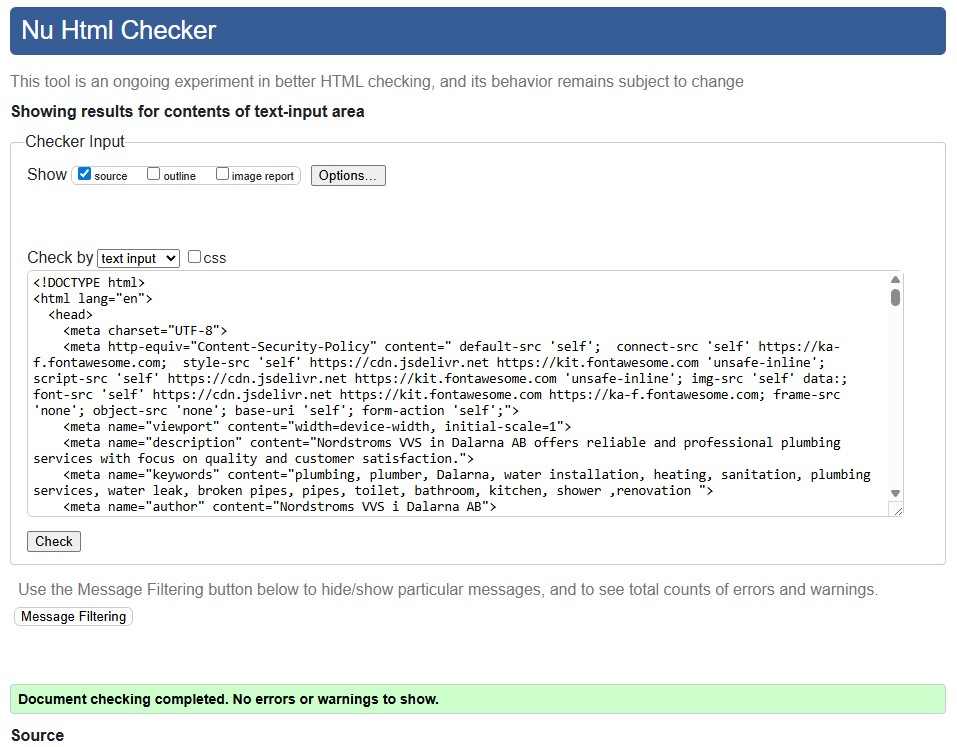

  
*Responsive design of the Home page displayed across multiple devices.*

# Nordstroms VVS

A professional and responsive website for a small plumbing company.

A simple marketing website built for a local plumbing business.  
This user-friendly site allows customers to explore plumbing services and contact the business easily.  
The website is designed with clarity, accessibility, and trust in mind — highlighting the company's local presence and service offerings.  

**Live Site:** [https://gooldenapple.github.io/vvs-nordstrom/](https://gooldenapple.github.io/vvs-nordstrom/)
---

## Contents

- [User Experience (UX)](#user-experience-ux)  
- [Design](#design)
- [Wireframes](#wireframes)  
- [Features](#features)  
- [Accessibility](#accessibility)  
- [Technologies Used](#technologies-used)  
- [Deployment & Local Development](#deployment--local-development)  
- [Testing](#testing)  
- [Credits](#credits)  

---

## User Experience (UX)

### UX Decisions

- The layout is fully responsive, optimized for mobile, tablet, and desktop to ensure a great user experience on all devices.  
- Colour and typography choices focus on readability and accessibility, meeting WCAG contrast standards.  
- Navigation is simple and consistent throughout the site, with clear call-to-action buttons.  

### Initial Discussion

Nordstroms VVS is a trusted local plumbing company offering professional services to homeowners and small businesses. Proudly serving the community, the company emphasizes reliable and friendly customer service.

This website has been developed to provide a clear and user-friendly experience, enabling first-time visitors to quickly understand the range of services offered. The design prioritizes simplicity and accessibility, ensuring that users of all technical levels can navigate the site with ease on any device thanks to its responsive layout.

Returning customers benefit from easy access to up-to-date contact information, while frequent visitors can efficiently submit inquiries or recommendations. Accessibility features are integrated to make the website usable for all, including those with disabilities.

By focusing on clarity and inclusivity, the site builds trust and encourages customer engagement, highlighting the core service areas of Water, Heating, and Sanitation.

### Key Information for the Site

- Clear navigation
- Contact options  
- Access to image gallery    
- Overview of plumbing services

### User Stories

#### Client Goals

**User Story:** 
  As the owner of Nordströms VVS, I want a simple, easy-to-navigate website that clearly presents our services and contact options, so that potential customers can quickly find what they are looking for and reach out to us without hassle.

**Acceptance Criteria:**  
- The website clearly displays all key services offered by the company.  
- Contact information is prominently visible on all pages.  
- The design is clean, straightforward, and user-friendly across all devices.  
- Navigation is intuitive and consistent throughout the site.  
- The site loads quickly and functions smoothly on both desktop and mobile devices.

**Tasks:**  
- Design and implement a clear homepage with service overview and call-to-action.  
- Ensure contact info is included in the header and footer on every page.  
- Apply responsive design principles and test across devices.  
- Create a consistent navigation menu with clear labels.  
- Optimize images and assets for fast loading times.

#### First Time Visitor Goals

**User Story:**  
  As a first-time visitor, I want to easily understand what services the company offers and be able to view past projects, so that I can quickly decide if they fit my needs and trust their expertise.

**Acceptance Criteria:**  
- Services are clearly listed on the homepage and the dedicated Services page.  
- Each service has a brief, easy-to-read description.  
- Clear navigation to the Services page is available from the homepage.  
- A Gallery page is accessible, showcasing past projects with high-quality images.  
- Gallery images have descriptive alt text for accessibility.

**Tasks:**  
- Create a concise services overview section on the homepage.  
- Build a dedicated Services page with detailed descriptions of each service.  
- Add call-to-action buttons linking between the homepage and Services page.  
- Develop a Gallery page displaying past projects with optimized images.  
- Ensure all gallery images include descriptive alt text.  
- Add navigation links to the Gallery page from relevant parts of the site.

#### Returning Visitor Goals

**User Story:**  
As a returning visitor, I want to find up-to-date information on the services offered and be able to quickly contact the company with any questions, so that I can stay informed and communicate easily.

**Acceptance Criteria:**  
- The Services page content is current and accurately reflects all offerings.  
- Contact information is clearly visible and easy to find on all pages.  
- The contact form is functional and user-friendly.  
- Contact links/buttons are accessible from every page.

**Tasks:**  
- Regularly review and update service descriptions on the Services page.  
- Ensure contact details (phone, email, address) are included in header and footer.  
- Maintain and test the contact form to ensure submissions work correctly.  
- Add prominent contact buttons or links throughout the site for quick access.

#### Frequent Visitor Goals

**User Story:**  
As a frequent visitor, I want to be able to submit inquiries or requests efficiently and recommend the company to others, so that I can maintain easy communication and share positive experiences.

**Acceptance Criteria:**  
- The contact form is easy to locate and simple to use on all devices.  
- Required fields are clearly marked and validated to prevent errors.  
- Users receive a confirmation message or are redirected to a thank you page after submission.  
- There is an easy way to share or recommend the company (e.g., social media links or share buttons).  

**Tasks:**  
- Ensure the contact form is accessible from all pages via navigation or footer.  
- Implement client-side validation for required fields in the contact form.  
- Add a confirmation message or automatic redirect to a thank you page after form submission.  
- Add social media share buttons or visible links for easy recommendations.  
- Test form functionality and share options on desktop and mobile.

#### Accessibility Considerations for Older Users

**User Story:**  
As an older user, I want clear and simple navigation without clutter, easy-to-find contact information, and buttons that are large and easy to click, so that I can use the website comfortably and without frustration.

**Acceptance Criteria:**  
- Navigation menus are straightforward, with minimal items and no unnecessary distractions.  
- Contact information (phone, email) is prominently displayed and accessible on all pages.  
- Buttons are sufficiently large, with clear labels and ample spacing for easy clicking.  
- The website uses high-contrast colors to improve readability.  
- Text size is adjustable or large enough for comfortable reading.

**Tasks:**  
- Simplify navigation menus and remove any clutter or overly complex elements.  
- Place contact info in header and footer in clear, easy-to-read format.  
- Style buttons with sufficient size, padding, and clear text labels.  
- Ensure color contrast meets WCAG AA standards.  
- Use relative units (em/rem) for font sizes to support user zooming.

---

## Design

### Colour Scheme

[Color Palette](assets/images/readme/color-palette.png) 

I chose a colour palette that reflects the professional, warm, and trustworthy nature of the plumbing business, inspired by natural copper and earth tones. 
The palette includes shades of brown and copper for warmth and reliability, complemented by clean whites and deep blacks for contrast and readability.

### Typography

The website uses Arial, sans-serif as the primary font to ensure high readability and simplicity across devices and screen sizes. 
Font sizes and weights have been carefully chosen to create a clear visual hierarchy, with larger, bolder headings to capture attention and smaller, easy-to-read body text. 
This choice supports accessibility and provides a clean, professional appearance fitting for the plumbing business.

### Imagery

**Hero Image:**  
The hero image shows flowing copper pipes with a dark green/gray tiled background.   
The image reflects the plumbing business's core services and matches the site's color palette for a cohesive design.
This image was sourced from [StockCake](https://stockcake.com) and has been optimized for web performance using TinyPNG. 

**About Us Image:**  
The About Us section features a photo of the Nordströms VVS company vehicle, symbolizing the company's local presence and commitment to professional service. 
Images have been optimized using TinyPNG.

**Gallery Images:**  
The gallery features a selection of high-quality images showcasing completed plumbing projects, highlighting craftsmanship and service variety. 
These images were provided by Nordströms VVS i Dalarna AB. 
All images have been optimized using TinyPNG.

---

## Wireframes

The wireframes below illustrate the planned layout and structure for each page of the Nordstroms VVS website. They were created to guide the design and ensure a user-friendly, responsive experience.

### Home Page

  
📸Home Page wireframe

 
*The homepage wireframe shows the hero section, navigation menu, services overview, and footer layout.*

### Services Page

  
📸Services Page wireframe

 
 
*This wireframe outlines the service categories with icons and descriptions, designed for clarity and easy navigation.*

### Gallery Page

  
📸Services Page wireframe

 
*The gallery page wireframe demonstrates a responsive grid layout with a mobile carousel for images.*

### Contact Page

  
📸Contact Page wireframe

  
*The contact page wireframe highlights the form layout with labeled fields, validation indicators, and submission button.*

### Success Page

  
📸Services Page wireframe

 
 
*This wireframe shows the confirmation message displayed after a successful form submission.*

---

## Features

### Page Overview

The website consists of five main pages:

- **Home:**  
  An engaging introduction to the company with a clear call-to-action button directing users to the Services page. The hero section features an appealing image and concise text to immediately communicate the company's expertise.

  

  
🏠 Homepage

  
   
   An introduction and about us section highlighting trust and professionalism, and clear call-to-action button leading to contact us page.
  

  

  
🏠 Homepage

     
   
  The homepage introduces the company with a welcoming hero section and clear call-to-action button.
  

- **Services:**  
  Detailed descriptions of the plumbing services offered, divided into three main categories: Water, Heating, and Sanitation. Each service card includes icons and descriptive text to enhance readability and user engagement.

  

  
🔧 Services Page

    
   
  The services page outlines the three main areas of expertise — Water, Heating, and Sanitation — each with icons and concise descriptions for clarity.  
  

- **Gallery:**  
  A responsive and accessible image gallery showcasing past projects, demonstrating the company’s craftsmanship and service range. The gallery includes a carousel for mobile/tablet devices to optimize viewing on smaller screens.

  

  
🖼️ Gallery Page

    
  The gallery showcases completed projects in a responsive grid layout, with optimized images and descriptive alt text.  
  

  

  
🔍 Gallery Lightbox View

    
  Clicking an image opens it in a lightbox view, allowing visitors to browse projects in larger detail with navigation controls.  
  

- **Contact:**  
  A user-friendly contact form with required fields, input validation, and clear call-to-action buttons. The form facilitates easy submission of inquiries or service requests and improves communication between users and the company.

  

  
📩 Contact Page

    
   
  The contact page includes a simple and accessible form for visitors to submit inquiries, alongside prominently displayed contact information.  
  

- **Success:**  
  A confirmation page displayed after successful form submission, providing reassurance that the message has been received and informing users about next steps.

  

  
✅ Success Page

    
   
  After submitting the form, users are redirected to a confirmation page thanking them and providing clear navigation back to other site sections.  
  

### General Features on All Pages

- Fully responsive navigation bar that adapts smoothly to different screen sizes, including a hamburger menu for mobile devices.  
- Consistent footer featuring contact information such as phone, email, physical address, and social media links.  
- Favicon present on all pages to reinforce brand identity.  
- Uniform styling, layout, and color scheme throughout the site to ensure a cohesive user experience.  
- Semantic HTML5 structure for improved accessibility and SEO.  
- Appropriate use of ARIA attributes and focus indicators to support keyboard navigation.

### Specific Features

- **Home:**  
  - Engaging hero section with overlay and clear text.  
  - Prominent call-to-action button leading to Services.  
  - Brief introduction about the company and its expertise.

- **Services:**  
  - Service cards grouped into Water, Heating, and Sanitation.  
  - Each card features a relevant icon and short description.  
  - Responsive layout adjusts nicely on different screen sizes.

- **Gallery:**  
  - Desktop grid layout with neat spacing between images.  
  - Mobile/tablet carousel for smooth browsing on smaller devices.  
  - All images include descriptive alt text for accessibility.

- **Contact:**  
  - Easy-to-use form with labeled fields and required validation.  
  - Clear submission button with hover and focus states.  
  - Accessible markup with proper labels and ARIA attributes.

- **Success:**  
  - Confirmation message after form submission.  
  - Brief info on what happens next.  
  - Navigation options back to key pages.

## Future Implementations

While the current version of the website meets the project requirements and provides a professional, accessible, and responsive user experience, several features could be added in the future to enhance functionality and value for users:

- **Online Booking System**  
  A booking form allowing customers to request appointments directly through the site, integrated with email notifications.

- **FAQ Section**  
  A dedicated page or section answering common customer questions regarding services, pricing, and availability.

- **Blog / News Section**  
  A space for publishing plumbing tips, updates about the company, and news from the industry, helping improve SEO and customer engagement.

- **Multi-Language Support**  
  Adding support for both Swedish and English to make the site more accessible for a broader audience.

- **Expanded Gallery**  
  A categorized gallery to showcase projects by type (e.g., water, heating, sanitation), allowing users to filter and view relevant work examples.

- **Customer Testimonials**  
  A section showcasing feedback and reviews from satisfied customers.  
  This would build trust and credibility for new visitors by highlighting positive experiences and recommendations.  
  Implementation could begin with a simple static testimonial section, with potential future integration of live reviews (e.g., from Google Reviews or social media).

---

## Accessibility

  Accessibility has been a key focus throughout the development of this website to ensure it is usable by as many people as possible, including those with disabilities.

- The website uses **semantic HTML5** elements to provide meaningful page structure and improve screen reader compatibility.
- All images include **descriptive alt text** to convey content and purpose to users relying on screen readers.
- Colour contrasts have been tested and meet **WCAG AA standards** to ensure readability for users with visual impairments.
- The navigation and interactive elements are fully **keyboard accessible**, with clear focus indicators for ease of use.
- **ARIA attributes** have been added where necessary to enhance assistive technology support.
- Form fields include **associated labels** and use appropriate input types for better accessibility and user experience.
- The site uses **relative units (em/rem)** for font sizes to allow users to adjust text size via browser settings.
- Buttons and links have sufficient size and spacing to facilitate easy clicking and tapping, beneficial for users with motor impairments.

---

## Technologies Used

### Languages

- **HTML5** — used to structure the website content with semantic elements.  
- **CSS3** — used for styling and responsive layout.
- **JavaScript** — used via Bootstrap for responsive navigation and via Lightbox for the interactive gallery.

### Frameworks and Libraries

- **Bootstrap 5** — for responsive layout and UI components, including the navbar and grid system.  
- **Font Awesome** — for scalable vector icons and social media logos.

### Tools and Services

- **Visual Studio Code** — primary code editor, with extensions for HTML, CSS, and Git integration.  
- **Git & GitHub** — for version control, repository hosting, and deployment via GitHub Pages.  
- **GitHub Pages** — hosting the live website.  
- **Google Fonts** — web-optimized typography, specifically Arial (system font fallback used).  
- **TinyPNG** — for image compression and resizing to optimize page load times.  
- **Squoosh** — for image optimization and compression.  
- **AmiResponsive** — for creating responsive device mockups in project documentation.  
- **Balsamiq** — for wireframing and creating mockups.  
- **Chrome DevTools / Browser DevTools** — for debugging, layout inspection, and performance tuning.  
- **Adobe Photoshop** — used for image editing and optimization.  
- **Lighthouse** — for auditing performance, accessibility, SEO, and best practices.  
- **Favicon** — custom site icon used to reinforce brand identity in browser tabs and bookmarks.
- **ChatGPT (OpenAI)** — AI assistant providing guidance and support with code review, documentation and text.
- **Diffchecker** — used for text comparison and version tracking.

---

## Project Management

To keep track of development progress and tasks, a GitHub Project Board was used.  
Below is a snapshot of the current board showing the different columns for Todo, In Progress, and Done tasks, including completed user stories and accessibility considerations.

Screenshot of user stories board

 
This board helps organize tasks, visualize progress, and ensure that all user stories and project goals are properly managed throughout development.

---

## Mockups

Mockups of the website were created using the online responsive mockup generator [TechSini Multi Mockup](https://techsini.com/multi-mockup/).  
This tool allows easy visualization of how the site looks across various devices such as desktops, tablets, and mobile phones.

---

## Deployment & Local Development

### GitHub Pages Deployment

This website is deployed using **GitHub Pages**.  
The live version of the site can be accessed at:  
[https://gooldenapple.github.io/vvs-nordstrom/](https://gooldenapple.github.io/vvs-nordstrom/)

### How Deployment Was Done

1. Created a new repository on GitHub for the project.  
2. Cloned the repository locally and connected it to Visual Studio Code.  
3. Developed the website files locally using Visual Studio Code.  
4. Committed and pushed changes from Visual Studio Code to the GitHub repository.  
5. In the GitHub repository, navigated to **Settings** > **Pages**.  
6. Set the publishing source to the `main` branch and selected the root folder.  
7. Saved the settings, allowing GitHub Pages to publish the website automatically.  
8. The site is now live and accessible via the GitHub Pages URL.

### Additional Deployment Details

- The `main` branch is the production branch; all live updates come from this branch.  
- Any commit pushed to `main` automatically triggers GitHub Pages to redeploy the website.  
- Currently, the website uses the default GitHub Pages URL. A custom domain can be configured in the future via GitHub Pages settings.  
- If GitHub Pages experiences downtime, the site can be run locally by cloning the repository and opening the files in a browser or using a local development server.

### Local Development

  To work on the project locally:  
1. Clone the repository to your local machine using the command:  
git clone https://github.com/gooldenapple/vvs-nordstrom.git
2. Open the project folder in your preferred code editor (e.g., Visual Studio Code).  
3. Make changes and test by opening the HTML files directly in a web browser or using a local development server extension in your editor.  
4. Commit and push changes to keep your GitHub repository updated.

### What does this mean?

1. **Clone the repo**  
`git clone https://github.com/gooldenapple/vvs-nordstrom.git`  
This command downloads the entire project from GitHub to your computer, giving you a local copy to work on.

2. **Open the project folder in your code editor**  
For example, Visual Studio Code, where you can edit HTML, CSS, and other files.

3. **Make changes and test locally**  
You can open HTML files directly in your browser or use a local development tool (like Live Server in VS Code) to see changes in real time.

4. **Commit and push**  
When you have made changes, you save them ("commit") and send them up to GitHub ("push") so the online version stays updated.

---

## Testing

### Manual Testing 

- The website was tested on various devices and screen sizes (desktop, tablet, mobile) to ensure responsive design and consistent layout.  
- All navigation links and buttons were checked to confirm they function correctly on every page.  
- The contact form was tested for required field validation, proper error handling, and successful submission flow, including redirection to the success page.  
- The image gallery was tested for proper loading, accessibility (alt text), and responsiveness, including carousel functionality on smaller devices.  
- Images and media files were verified for correct display and optimization to maintain fast load times.  
- Accessibility features were manually tested, including keyboard navigation and focus indicators.

### Manual Testing of Key Features

| Feature              | Expected Result                                             | Action Performed                          | Actual Result                                | Status |
|----------------------|-------------------------------------------------------------|-------------------------------------------|-----------------------------------------------|--------|
| **Navbar**           | Collapses to hamburger on small screens                     | Resize browser to mobile width             | Hamburger menu appears and functions as expected | ✅ Pass |
| **Hero CTA Button**  | Navigates to Services page                                  | Click "Our Services" button                | Redirects to `services.html`                   | ✅ Pass |
| **Gallery Lightbox** | Opens enlarged image with navigation arrows                 | Click on gallery image                     | Lightbox opens, images navigable               | ✅ Pass |
| **Contact Form**     | Validates required fields                                   | Submit empty form                          | Validation error shown                         | ✅ Pass |
| **Contact Form**     | Redirects after successful submission                       | Submit valid form                          | Redirects to `success.html` with confirmation  | ✅ Pass |
| **Footer Links**     | Open external resources in correct apps or new tabs(socials,contact info)| Click footer links             | Links open in new window                      | ✅ Pass |
| **Responsive Layout**| Content adjusts for desktop, tablet, and mobile             | Test on multiple devices/simulators        | Layout adapts correctly without major issues   | ✅ Pass |

### Browser Testing

The website was tested on multiple browsers and devices to ensure consistent performance and user experience. Testing was conducted on:

- **Google Chrome**  
- **Microsoft Edge**  
- **Mozilla Firefox**  
- **Mobile/tablet device**
- **safari**

During these tests, the site performed well across all platforms with one minor issue identified only in Microsoft Edge:  
The contact form section had some alignment problems.  

This issue is addressed and solved.

### Accessibility Testing

Accessibility was tested manually and with automated tools to ensure the site is usable for all visitors, including those with additional needs:

- **Automated Testing:**  
  - Lighthouse accessibility audits consistently returned a score of 100.  
  - WAVE Web Accessibility Evaluation Tool showed no critical issues.  

- **Manual Testing:**  
  - All images include descriptive `alt` attributes.  
  - Headings (`h1–h6`) follow a logical order for screen readers.  
  - Sufficient color contrast verified using contrast checkers.  
  - All interactive elements (buttons, links, form inputs) are reachable and operable using only the keyboard.  
  - Focus indicators are visible and clear when tabbing through the site.  
  - Font sizes use relative units (`em`, `rem`) to support browser zooming.  

These tests confirm that the site meets WCAG 2.1 AA standards for accessibility.

## User Story Testing

### Client Goals — Simple and user-friendly website

| Expected Result | Action Performed | Actual Result | Status |
|-----------------|-----------------|---------------|--------|
| Website clearly displays key services | Load homepage and services page | Services overview visible and detailed page available | ✅ Pass |
| Contact info visible on all pages | Inspect header and footer on all pages | Contact details consistently displayed | ✅ Pass |
| Clean and responsive design | Test across devices and screen sizes | Layout responsive and user-friendly | ✅ Pass |
| Navigation intuitive and consistent | Use navbar on desktop/mobile | Navbar consistent and responsive | ✅ Pass |
| Site loads quickly | Run Lighthouse and manual tests | Optimized images, fast load | ✅ Pass |

---

### First Time Visitor Goals — Understand services & view past projects

| Expected Result | Action Performed | Actual Result | Status |
|-----------------|-----------------|---------------|--------|
| Services clearly listed on homepage and Services page | Visit homepage and `services.html` | Overview + Water/Heating/Sanitation sections present | ✅ Pass |
| Each service has brief, easy-to-read description | Inspect `services.html` | Clear, concise descriptions provided | ✅ Pass |
| Clear navigation to Services page | Click CTA on homepage | Directs correctly to `services.html` | ✅ Pass |
| Gallery page accessible with project images | Navigate to `gallery.html` | Gallery grid loads as expected | ✅ Pass |
| Gallery images include descriptive alt text | Inspect gallery HTML | All images include descriptive alt text | ✅ Pass |

---

### Returning Visitor Goals — Up-to-date info & quick contact

| Expected Result | Action Performed | Actual Result | Status |
|-----------------|-----------------|---------------|--------|
| Services page content is current | Review `services.html` | Services accurately listed | ✅ Pass |
| Contact info easy to find on all pages | Check header/footer | Phone, email, and address visible | ✅ Pass |
| Contact form functional and user-friendly | Submit test entry in form | Redirect to success page, data accepted | ✅ Pass |
| Contact links accessible throughout site | Inspect navigation and CTAs | Prominent contact buttons on homepage/services | ✅ Pass |

---

### Frequent Visitor Goals — Efficient inquiries & sharing

| Expected Result | Action Performed | Actual Result | Status |
|-----------------|-----------------|---------------|--------|
| Contact form easy to locate on all devices | Check navbar/footer across pages | Form accessible on all screens | ✅ Pass |
| Required fields validated | Submit form with missing info | Validation error displayed | ✅ Pass |
| Confirmation or thank you page after submission | Submit valid form | Redirected to `success.html` | ✅ Pass |
| Easy way to share/recommend company | Inspect footer for links | Social media/contact links available | ✅ Pass |

---

### Accessibility — Older Users

| Expected Result | Action Performed | Actual Result | Status |
|-----------------|-----------------|---------------|--------|
| Simple and uncluttered navigation | Inspect navbar/menus | Straightforward, no clutter | ✅ Pass |
| Contact info prominent on all pages | Check header/footer | Always visible and readable | ✅ Pass |
| Buttons large, labeled, and easy to click | Test on mobile/tablet | Buttons ≥44px with clear spacing | ✅ Pass |
| High contrast colors for readability | Run Lighthouse/WAVE | Meets WCAG AA contrast | ✅ Pass |
| Text size readable and scalable | Zoom text in browser | Rem/em units allow scaling | ✅ Pass |

### Automated Testing & Tools

- Used **W3C HTML Validator** to ensure semantic and valid HTML markup.  
- Used **W3C CSS Validator** to check for any CSS syntax errors and maintain styling consistency.  
- Performed accessibility audits using **Lighthouse** and **WebAIM Contrast Checker** to verify compliance with WCAG AA standards for colour contrast and usability.  
- Audited performance and best practices with **Google Lighthouse**, focusing on improving Largest Contentful Paint, image optimization, caching policies, and eliminating legacy JavaScript for modern browsers.  
- Used **Chrome DevTools** for debugging layout issues, checking console errors, and monitoring network performance during development.

### Code Validation

- **CSS Validation:**  
  The stylesheet passed the [W3C CSS Validation Service](https://jigsaw.w3.org/css-validator/) with no errors, confirming compliance with CSS3 standards.

Css validation screenshot

 
  
*Screenshot from the W3C CSS Validator showing no errors, confirming CSS compliance.*

 

- **HTML Validation:**  
  All HTML files were validated using the [W3C Markup Validation Service](https://validator.w3.org/).  
  - Several errors were found related to invalid file paths containing spaces, e.g., `favicon_io (3)/favicon.ico`. These paths has been renamed to remove spaces for compliance.  
  - Backslashes (`\`) were used in image `srcset` attributes; these must be replaced with forward slashes (`/`) to avoid errors.  
  - Some `` elements had empty `src` attributes or missing `alt` texts, which were corrected to improve accessibility and pass validation.
  - Some end tags were missing or stray, this was fixed by locating the issues and finding the right start tag.

 

Home Page HTML validation Screenshot before

 
 
*Screenshot showing the results from the W3C HTML Validator, indicating validation errors and warnings.*

Home Page HTML validation Screenshot after

 
*Screenshot showing the results from the W3C HTML Validator after fixing bugs.*

Service Page HTML validation Screenshot before

 
*Screenshot showing the results from the W3C HTML Validator, indicating validation errors and warnings.*

Service Page HTML validation Screenshot after

 
*Screenshot showing the results from the W3C HTML Validator after fixing bugs.*

contact Page HTML validation Screenshot

 
*Screenshot showing the results from the W3C HTML Validator, showing no errors.*

Success Page HTML validation Screenshot

 
*Screenshot showing the results from the W3C HTML Validator, showing no errors.*

Gallery Page HTML validation Screenshot

 
*Screenshot showing the results from the W3C HTML Validator, showing no errors.*

---

### Lighthouse Testing

- Conducted on both desktop and mobile, scores have improved to a performance range of 90–100.  
- Accessibility scores consistently at 100, reflecting good semantic structure and ARIA usage.  
- SEO scores at 100, indicating good metadata and mobile-friendliness.  
- Best Practices scores around 81–82, with a warning for deprecated APIs and caching policies.  
- Largest Contentful Paint (LCP) improved but can be optimized further.  
- Cumulative Layout Shift (CLS) issues resolved by defining explicit image dimensions and stabilizing hero/navigation elements. 

## Lighthouse Audit Results

Home Page Screenshot

 
 
*Screenshots of mobile and desktop lighthouse scores, improved performance after image optimization, caching fixes, and CSS minification.*

Service Page Screenshot

 
 
*Screenshots of mobile and desktop lighthouse scores, improved performance after image optimization, caching fixes, and CSS minification.*

Contact Page Screenshot

 
*Screenshots of mobile and desktop lighthouse scores, improved performance after image optimization, caching fixes, and CSS minification.*

Success Page Screenshot

 
*Screenshots of mobile and desktop lighthouse scores, improved performance after image optimization, caching fixes, and CSS minification.*

Gallery Page Screenshot

 
 
*Screenshots of mobile and desktop lighthouse scores, improved performance after image optimization, caching fixes, and CSS minification.*

---

### Known Fixes

- Conducted a thorough review of all HTML and CSS code to identify and fix broken or incorrect code, links and image paths.  
- Corrected file paths by removing spaces and replacing backslashes (\) with forward slashes (/) to comply with web standards.  
- Optimized images with TinyPNG and Squoosh for faster loading times.  
- Corrected FontAwesome usage to avoid legacy JavaScript warnings.  
- Adjusted hero image position and scaling for better presentation.  
- Fixed inconsistent heading hierarchy (`h1`, `h2`, `h3`) to improve accessibility and SEO.  
- Added `alt` attributes to all images for improved accessibility and Lighthouse compliance.  
- Ensured consistent use of semantic HTML5 elements (`header`, `main`, `section`, `footer`).  
- Fixed layout issues on smaller screen sizes (mobile and tablet) with responsive CSS adjustments.  
- Adjusted Bootstrap grid usage for better alignment and spacing.  
- Corrected color contrast issues to meet WCAG accessibility standards.  
- Removed unused CSS and redundant code for cleaner, more maintainable files.  
- Improved navigation bar responsiveness and spacing on different screen sizes.  
- Fixed missing favicon link to ensure consistent branding in browsers.  
- Corrected `success.html` redirect and form handling consistency.
- Implemented **lazy loading** on images to reduce initial load time and improve performance.  
- Added **preload** for key resources (fonts, hero image) to improve render speed and Largest Contentful Paint (LCP). 
- Eliminated **layout shifts (CLS issues)** by defining explicit image dimensions and stabilizing hero and navigation elements. 

## Known Issues and Future Improvements

- **CSS & Performance Optimization:** Some CSS can still be cleaned and fully minified. Critical CSS inlining and further script deferrals are planned.  
- **Responsive Enhancements:** While major layout issues have been fixed, additional fine-tuning may be needed.  
- **Accessibility Improvements:** Current accessibility scores are strong, but future work includes adding ARIA landmarks and expanding keyboard navigation testing.  
- **Image Optimization:** All current images are optimized and lazy loaded, but future improvements may include converting assets fully to next-gen formats (WebP/AVIF).  
- **Caching Policy:** Static assets currently lack optimal cache headers; implementation is planned for further performance gains.  
- **Network Payload Size:** Although reduced, overall page weight could still be improved through additional compression and deferred loading of non-critical resources.  
- **SEO Enhancements:** Planned improvements include adding structured data (schema.org) and further refining meta descriptions for better search visibility.  

---

## Credits

### Code Used

- Navigation bar inspired by Bootstrap’s responsive navbar components.  
- Some JavaScript functionality, including the mobile and desktop gallery lightbox, was implemented with help from ChatGPT by OpenAI.  
- Video: [Wrapper Classes: A Layout Foundation](https://www.youtube.com/watch?v=tr7EH48TFiE)  
- Web development tutorials and examples referenced from **W3Schools**.  
- Website: [https://www.w3schools.com](https://www.w3schools.com)

### Media

- **Hero Image:**  
  "Flowing Copper Pipes" sourced from [Stockcake](https://stockcake.com/i/flowing-copper-pipes_1699161_1227474).  
  Royalty-free under Stockcake's license, optimized with TinyPNG.

- **Icons:**  
  Used icons from **Font Awesome** for service representation and social media.

- **Gallery Images:**  
  Provided by Nordströms VVS i Dalarna AB.
  

## Acknowledgements

I would like to thank everyone who has supported and contributed to this project, including:

- Code Institute for providing the learning environment and resources that made this project possible.  
- The Student Care team for their ongoing support and encouragement.
- Roman at tutor assistance, for the guidence and support.
- Nordströms VVS for providing images and content to showcase their business.   
- ChatGPT (OpenAI) for guidance and assistance throughout the development process.
- My family for supporting me during this time.  
 

