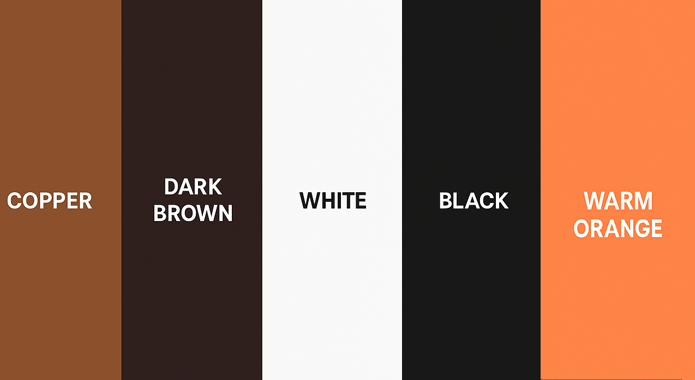

  
*Responsive design of the Home page displayed across multiple devices.*

# Nordströms VVS

A professional and responsive website for a small plumbing company.

A simple marketing website built for a local plumbing business.  
This user-friendly site allows customers to explore plumbing services and contact the business easily.  
The website is designed with clarity, accessibility, and trust in mind — highlighting the company's local presence and service offerings.  

**Live Site:** [https://gooldenapple.github.io/vvs-nordstrom/](https://gooldenapple.github.io/vvs-nordstrom/)

**Repo:** https://github.com/gooldenapple/vvs-nordstrom

---

## Contents

- [User Experience (UX)](#user-experience-ux)
  - [Project Purpose](#project-purpose)
  - [UX Decisions](#ux-decisions)
  - [Initial Discussion](#initial-discussion)
  - [Key Information for the Site](#key-information-for-the-site)
  - [User Stories](#user-stories)
    - [Client Goals](#client-goals)
    - [First Time Visitor Goals](#first-time-visitor-goals)
    - [Returning Visitor Goals](#returning-visitor-goals)
    - [Frequent Visitor Goals](#frequent-visitor-goals)
    - [Accessibility Considerations for Older Users](#accessibility-considerations-for-older-users)  
- [Design](#design)
  - [Colour Scheme](#colour-scheme)
  - [Typography](#typography)
  - [Imagery](#imagery)
  - [Wireframes](#wireframes)
- [Features](#features)  
  - [Global Features](#global-features)
  - [Page-specific Features](#page-specific-features)
- [Future Implementations](#future-implementations)
- [Accessibility](#accessibility)  
- [Technologies Used](#technologies-used)  
- [Deployment & Local Development](#deployment--local-development)   
  - [Deployment (GitHub Pages)](#deployment-github-pages)
  - [Local Development](#local-development)
  - [How to Fork](#how-to-fork)
  - [How to Clone](#how-to-clone)
- [Testing](#testing)  
  - [Manual Feature Testing](#manual-feature-testing)
  - [User Story Testing](#user-story-testing)
  - [Accessibility Testing](#accessibility-testing)
  - [Browser Testing](#browser-testing)
  - [Automated Testing](#automated-testing)
  - [Code Validation](#code-validation)
  - [Lighthouse Testing](#lighthouse-testing)
  - [Bug Fixes & Future Improvements](#bug-fixes--future-improvements)
- [Appendix / Process & Artifacts](#appendix--process--artifacts)
  - [Project Management](#project-management)
  - [Mockups](#mockups)
  - [Design/Doc tools](#designdoc-tools)
- [Credits](#credits)  
- [Acknowledgements](#acknowledgements)


---

## User Experience (UX)

### Project Purpose

The purpose of this project is to provide **Nordströms VVS** with a professional and accessible online presence that supports both the company's goals and the needs of its users.  

- **Business goals:** Increase visibility of the company, clearly present offered services, and make it easy for potential customers to get in contact.  
- **User goals:** Quickly understand what the company does, easily find contact information, and view examples of past work for reassurance and trust.  

The website therefore acts as both a **marketing tool** and a **practical communication channel**, ensuring customers can move smoothly from discovering the company to making an inquiry.

### UX Decisions

- The layout is fully responsive, optimized for mobile, tablet, and desktop to ensure a great user experience on all devices.  
- Colour and typography choices focus on readability and accessibility, meeting WCAG contrast standards.  
- Navigation is simple and consistent throughout the site, with clear call-to-action buttons.  

### Initial Discussion

Nordströms VVS is a trusted local plumbing company offering professional services to homeowners and small businesses. Proudly serving the community, the company emphasizes reliable and friendly customer service.

This website has been developed to provide a clear and user-friendly experience, enabling first-time visitors to quickly understand the range of services offered. The design prioritizes simplicity and accessibility, ensuring that users of all technical levels can navigate the site with ease on any device thanks to its responsive layout.

Returning customers benefit from easy access to up-to-date contact information, while frequent visitors can efficiently submit inquiries or recommendations. Accessibility features are integrated to make the website usable for all, including those with disabilities.

By focusing on clarity and inclusivity, the site builds trust and encourages customer engagement, highlighting the core service areas of Water, Heating, and Sanitation.

### Key Information for the Site

- Clear navigation
- Contact options  
- Access to image gallery    
- Overview of plumbing services

### User Stories

#### Client Goals
**User Story:** 
  As the owner of Nordströms VVS, I want a simple, easy-to-navigate website that clearly presents our services and contact options, so that potential customers can quickly find what they are looking for and reach out to us without hassle.

**Acceptance Criteria:**  
- The website clearly displays all key services offered by the company.  
- Contact information is prominently visible on all pages.  
- The design is clean, straightforward, and user-friendly across all devices.  
- Navigation is intuitive and consistent throughout the site.  
- The site loads quickly and functions smoothly on both desktop and mobile devices.

**Tasks:**  
- Design and implement a clear homepage with service overview and call-to-action.  
- Ensure contact info is included in the header and footer on every page.  
- Apply responsive design principles and test across devices.  
- Create a consistent navigation menu with clear labels.  
- Optimize images and assets for fast loading times.

#### First Time Visitor Goals
**User Story:**  
  As a first-time visitor, I want to easily understand what services the company offers and be able to view past projects, so that I can quickly decide if they fit my needs and trust their expertise.

**Acceptance Criteria:**  
- Services are clearly listed on the homepage and the dedicated Services page.  
- Each service has a brief, easy-to-read description.  
- Clear navigation to the Services page is available from the homepage.  
- A Gallery page is accessible, showcasing past projects with high-quality images.  
- Gallery images have descriptive alt text for accessibility.

**Tasks:**  
- Create a concise services overview section on the homepage.  
- Build a dedicated Services page with detailed descriptions of each service.  
- Add call-to-action buttons linking between the homepage and Services page.  
- Develop a Gallery page displaying past projects with optimized images.  
- Ensure all gallery images include descriptive alt text.  
- Add navigation links to the Gallery page from relevant parts of the site.

#### Returning Visitor Goals
**User Story:**  
As a returning visitor, I want to find up-to-date information on the services offered and be able to quickly contact the company with any questions, so that I can stay informed and communicate easily.

**Acceptance Criteria:**  
- The Services page content is current and accurately reflects all offerings.  
- Contact information is clearly visible and easy to find on all pages.  
- The contact form is functional and user-friendly.  
- Contact links/buttons are accessible from every page.

**Tasks:**  
- Regularly review and update service descriptions on the Services page.  
- Ensure contact details (phone, email, address) are included in header and footer.  
- Maintain and test the contact form to ensure submissions work correctly.  
- Add prominent contact buttons or links throughout the site for quick access.

#### Frequent Visitor Goals
**User Story:**  
As a frequent visitor, I want to be able to submit inquiries or requests efficiently and recommend the company to others, so that I can maintain easy communication and share positive experiences.

**Acceptance Criteria:**  
- The contact form is easy to locate and simple to use on all devices.  
- Required fields are clearly marked and validated to prevent errors.  
- Users receive a confirmation message or are redirected to a thank you page after submission.  
- There is an easy way to share or recommend the company (e.g., social media links or share buttons).  

**Tasks:**  
- Ensure the contact form is accessible from all pages via navigation or footer.  
- Implement client-side validation for required fields in the contact form.  
- Add a confirmation message or automatic redirect to a thank you page after form submission.  
- Add social media share buttons or visible links for easy recommendations.  
- Test form functionality and share options on desktop and mobile.

#### Accessibility Considerations for Older Users
**User Story:**  
As an older user, I want clear and simple navigation without clutter, easy-to-find contact information, and buttons that are large and easy to click, so that I can use the website comfortably and without frustration.

**Acceptance Criteria:**  
- Navigation menus are straightforward, with minimal items and no unnecessary distractions.  
- Contact information (phone, email) is prominently displayed and accessible on all pages.  
- Buttons are sufficiently large, with clear labels and ample spacing for easy clicking.  
- The website uses high-contrast colors to improve readability.  
- Text size is adjustable or large enough for comfortable reading.

**Tasks:**  
- Simplify navigation menus and remove any clutter or overly complex elements.  
- Place contact info in header and footer in clear, easy-to-read format.  
- Style buttons with sufficient size, padding, and clear text labels.  
- Ensure color contrast meets WCAG AA standards.  
- Use relative units (em/rem) for font sizes to support user zooming.

_Traceability:_ These user stories are verified in **Testing → User Story Testing**.

---

## Design

### Colour Scheme

 
*Colour palette: copper, dark brown, white, black, warm orange*

The chosen palette reflects professionalism and trust, inspired by natural copper and earth tones.  
- **Copper/Brown shades** convey warmth and reliability.  
- **White** provides clarity and clean contrast.  
- **Black/Dark tones** enhance readability and accessibility.  

This balance ensures the site is visually appealing while meeting WCAG contrast standards.  

**Colour roles**
- **Primary Copper/Brown:**  `#8b4d2b`, `#7a3f1f`, `#69361a`, `#d7893f` - highlights, buttons, social links and key accents
- **Background white:** `#fff` - page background, hero text and content surfaces
- **Text Black/Dark:** `#000`, `#444` - body text and headings for maximum readability

### Typography

The website uses **Arial, sans-serif** for clarity and cross-device compatibility.  
- **Headings** are bold and large to create a strong visual hierarchy.  
- **Body text** is lightweight, easy to read, and optimized with relative units.  

This combination ensures readability, accessibility, and a clean professional look that reflects the company’s identity.  

### Interaction States

Buttons and links include clear **hover**, **focus**, and **disabled** states (with visible focus outlines and non-color cues). The Contact form’s **Send** button remains disabled until all required fields are valid (client-side validation).

### Imagery

- **Hero Image:** Flowing copper pipes, symbolizing the core plumbing services.  
- **About Us Image:** Company vehicle photo, representing local presence and professionalism.  
- **Gallery Images:** High-quality examples of completed projects, showcasing craftsmanship.  

All images are optimized for web, compressed for fast loading, and include descriptive `alt` text for accessibility. 
Image dimensions (via explicit `width`/`height` or `aspect-ratio`) are defined to prevent layout shift (CLS) on initial load.

### Wireframes

The wireframes below illustrate the planned layout and structure for each page of the Nordströms VVS website. They were created to guide the design and ensure a user-friendly, responsive experience.

#### Home Page
<details>
  <summary>📸 Home Page wireframe</summary>


<br>
*The homepage wireframe shows the hero section, navigation menu, services overview, and footer layout.*
</details>

#### Services Page
<details>
  <summary>📸 Services Page wireframe</summary>

 
<br>
*This wireframe outlines the service categories with icons and descriptions, designed for clarity and easy navigation.*
</details>

#### Gallery Page
<details>
  <summary>📸 Gallery Page wireframe</summary>


<br>
*The gallery page wireframe demonstrates a responsive grid layout with a mobile carousel for images.*
</details>

#### Contact Page
<details>
  <summary>📸 Contact Page wireframe</summary>


<br> 
*The contact page wireframe highlights the form layout with labeled fields, validation indicators, and submission button.*
</details>

#### Success Page
<details>
  <summary>📸 Success Page wireframe</summary>

 
<br>
*This wireframe shows the confirmation message displayed after a successful form submission.*
</details>

---

## Features

### Global Features

- Responsive navigation bar with hamburger menu on mobile.  
- Favicon present on all pages for brand identity.  
- Uniform styling and consistent color scheme.  
- Semantic HTML5 structure.  
- ARIA attributes and visible focus indicators for keyboard navigation.
- “Skip to main content” link for keyboard users. 
- Footer with **clickable** contact info: phone (`tel:`), email (`mailto:`), address (opens Google Maps), and social icons (open in new tab with `rel="noopener noreferrer"`).


### Page-specific Features

- **Home:**  
  - Engaging hero section with overlay text and clear call-to-action.  
  - Introduction and "About Us" section highlighting trust, professionalism, and company values.  
  <details>
    <summary>🏠 Homepage</summary>

    
    <br>
       
    <br>
    *The homepage introduces the company with a welcoming hero and clear CTAs to services and contact.*
  </details>

- **Services:**  
  - Detailed descriptions of plumbing services, divided into three categories: **Water, Heating, and Sanitation**.  
  - Each service card includes an icon and short description for clarity.  
  <details>
    <summary>🔧 Services Page</summary>

      
    <br>
    *The services page outlines the three main areas of expertise — Water, Heating, and Sanitation.*
  </details>

- **Gallery:**  
  - Responsive and accessible gallery showcasing completed projects.  
  - Desktop: grid layout. 
  - Mobile/Tablet: carousel. 
  - Lightbox for enlarged viewing. 
  - All images include descriptive `alt` text.  
  <details>
    <summary>🖼️ Gallery Page</summary>

      
    <br>
    *Responsive grid layout with optimized images and alt text.*  
  </details>
  <details>
    <summary>🔍 Gallery Lightbox View</summary>

      
    <br>
    *Lightbox view for enlarged browsing with navigation controls.*  
  </details>

- **Contact:**    
  - User-friendly form with required fields, validation, and clear labels.
  - “Send” button remains disabled until all required fields are valid.  
  - Contact information (phone, email, address) alongside the form.  
  <details>
    <summary>📩 Contact Page</summary>

      
    <br>
    *Accessible form and clearly displayed contact information.*  
  </details>

- **Success:**  
  - Confirmation page shown after form submission, with navigation options back to key pages.  
  <details>
    <summary>✅ Success Page</summary>

      
    <br>
    *Confirmation page thanking users and guiding them back to other sections.*  
  </details>

---

## Future Implementations

**Listed in priority order:**

1. **Lightbox swipe gestures on mobile** – improve image browsing ergonomics.
2. **Multi-Language Support** – Swedish and English for wider accessibility.
3. **Expanded Gallery** – categorized by service type.
4. **FAQ Section** – answers to common customer questions.
5. **Customer Testimonials** – static section or live reviews integration.
6. **Blog/News Section** – plumbing tips, updates, SEO boost. 
7. **Online Booking System** – direct appointment requests with email notifications.

---

## Accessibility

Accessibility has been a key focus during the development of this project to ensure that the website is usable by as many people as possible, including those with disabilities and older users.

- **Semantic HTML5** – used for meaningful structure, improving screen reader compatibility.  
- **Descriptive `alt` text** – provided for all images, conveying purpose and content.  
- **WCAG AA compliant color contrast** – tested with Lighthouse and WebAIM Contrast Checker.  
- **Keyboard accessibility** – all interactive elements can be navigated via keyboard, with clear focus indicators.  
- **ARIA attributes** – ARIA attributes – used where necessary.
- **Form labels** – all input fields have associated labels for clarity.  
- **Relative font sizing (em/rem)** – used to allow users to scale text.  
- **Large, clickable buttons and links** – with proper spacing, improving usability on touch devices and for users with motor impairments.  
- **“Skip to main content” link** – becomes visible on focus to speed up keyboard navigation.
- **Landmarks** – via semantic regions (`<header>`, `<nav>`, `<main>`, `<footer>`) improve screen reader navigation.

---

## Technologies Used

### Languages
- **HTML5** — used to structure the website content with semantic elements.  
- **CSS3** — used for styling and responsive layout.
- **JavaScript** — used via Bootstrap (navbar/Carousel) and via Lightbox for the interactive gallery.

### Frameworks and Libraries
- **Bootstrap 5** — for responsive layout and UI components, (navbar, grid, carousel).  
- **Font Awesome** — for scalable vector icons and social media logos.
- **Lightbox** — for image overlay and enlarged viewing in the Gallery.

### Tools and Services
- **Visual Studio Code** — primary code editor, with extensions for HTML, CSS, and Git integration.  
- **Git & GitHub** — for version control, repository hosting, and deployment via GitHub Pages.  
- **GitHub Pages** — hosting the live website.  
- **CDN delivery** — third-party libraries (Bootstrap, Font Awesome, Lightbox) loaded via CDN.  
- **TinyPNG** — image compression and optimization for performance.  
- **Squoosh** — for image optimization and compression.  
- **Chrome DevTools / Browser DevTools** — for debugging, layout inspection, and performance tuning.  
- **Lighthouse** — performance, accessibility, SEO, and best practices audits.  
- **WAVE Web Accessibility Evaluation Tool** — automated accessibility checks.  
- **NVDA (NonVisual Desktop Access)** — screen reader used for accessibility testing.  
- **WebAIM Contrast Checker** — ensured color contrast met WCAG 2.1 AA.  
- **W3C HTML & CSS Validators** — validated semantic and standards-compliant code.  
- **Favicon Generator** — custom site icon used to reinforce brand identity in browser tabs and bookmarks.  
- **ChatGPT (OpenAI)** — assisted with JavaScript, code review, documentation, and text.  

---
 
## Deployment & Local Development

### Deployment (GitHub Pages)

This site is deployed using **GitHub Pages**.

**Live site:** <https://gooldenapple.github.io/vvs-nordstrom/>

**Steps to deploy:**
1. Log in (or sign up) to **GitHub**.
2. Open the repository: **gooldenapple/vvs-nordstrom**.
3. Go to **Settings → Pages**.
4. Under **Build and deployment**, set:
   - **Source:** `Deploy from a branch`
   - **Branch:** `main`
   - **Folder:** `/ (root)`
5. Click **Save**. GitHub Pages will build and publish the site.
6. When the deployment banner shows success (or in **Actions/Pages**), visit the **Live site** URL.

Any commit pushed to `main` triggers an automatic redeploy.

---

### Local Development

To run this project locally:

1. **Clone the repository**
   ```bash
   git clone https://github.com/gooldenapple/vvs-nordstrom.git
    ```
2. **Navigate into the project folder**
    ```bash
    cd vvs-nordstrom
    ```
3. **Open the site in a browser**
   - Double-click `index.html`, **or**
   - Use a local server (recommended):
     - VS Code: install the *Live Server* extension and click **Go Live**.

This project is a static HTML/CSS site — no build steps or extra dependencies are required.
Third-party libraries (Bootstrap, Font Awesome, Lightbox) are loaded via CDN.

### How to Fork

1. Log in (or sign up) to **GitHub**.
2. Go to the original repository: <https://github.com/gooldenapple/vvs-nordstrom>.
3. Click **Fork** (top-right) to create a copy under your GitHub account.


### How to Clone

Clone the project to your local machine. You can clone your fork (recommended if you plan to push changes) or the original repository (read-only).

**Clone your fork (recommended):**

1. On your fork’s page (`<your-username>/vvs-nordstrom`), click **Code**, choose **HTTPS** or **SSH** (or **GitHub CLI**), and copy the clone URL.
2. In your terminal, navigate to the folder where you want the project, then run:
```bash
git clone https://github.com/<your-username>/vvs-nordstrom.git
cd vvs-nordstrom
```
**or clone the original (read-only):**
```bash
git clone https://github.com/gooldenapple/vvs-nordstrom.git
cd vvs-nordstrom
```

---


## Testing

Testing was carried out throughout the development process using both **manual** and **automated** methods to ensure functionality, responsiveness, performance, and accessibility.

---

### Manual Feature Testing

| Section / Feature      | Action | Expected Outcome | Status |
|-------------------------|--------|------------------|--------|
| **Navigation** | Click each navbar link | Correct page displayed | ✅ Pass |
| | Use skip link | Focus jumps to `<main>` | ✅ Pass |
| | Navbar on mobile | Collapses into hamburger menu and expands on click | ✅ Pass |
| **Hero Section** | Resize browser | Hero image scales correctly | ✅ Pass |
| | Click CTA button | Redirects user to `services.html` | ✅ Pass |
| **About Us** | Hover over image | Smooth zoom-in effect | ✅ Pass |
| | Click *Contact Us* button | Redirects user to `contact.html` | ✅ Pass |
| **Services Page** | View service cards | All three cards display correctly | ✅ Pass |
| | Resize browser | Cards stack neatly on small screens | ✅ Pass |
| **Gallery Page** | Load all images | Images display with correct aspect ratio | ✅ Pass |
| | Resize browser | Grid adjusts without overlap | ✅ Pass |
| | Open lightbox | Image opens in lightbox with navigation arrows | ✅ Pass |
| **Contact Form** | Submit empty form | Browser validation blocks submission | ✅ Pass |
| | Submit invalid email | Error message displayed | ✅ Pass |
| | Submit valid form | Redirects user to `success.html` | ✅ Pass |
| **Success Page** | Load page | Focus automatically moves to confirmation heading | ✅ Pass |
| | Screen reader test (NVDA) | Heading and confirmation text read correctly | ✅ Pass |
| **Footer** | Click phone link | Opens the dialer | ✅ Pass |
| | Click email link | Opens default mail client | ✅ Pass |
| | Click address link | Opens Google Maps in new tab | ✅ Pass |
| | Click social icons | Open in new tab with correct `rel` attributes | ✅ Pass |
| **Responsive Design** | Test at 360px, 768px, 1024px, 1440px+ | Layout adapts with no hidden or overlapping content | ✅ Pass |
| **Accessibility – Older Users** | Inspect navigation | Simple and uncluttered | ✅ Pass |
| | Check contact info | Always visible in header and footer | ✅ Pass |
| | Test button size | Large enough for easy clicking | ✅ Pass |
| | Run color contrast test | Meets WCAG 2.1 AA standards | ✅ Pass |
| | Zoom text in browser | Text scales correctly | ✅ Pass |
| **Gallery Page** | Use carousel controls (mobile/tablet) | Slides change and indicators update; no layout shift | ✅ Pass |
| **Contact Form** | Send button before valid input | Button remains disabled until required fields are valid | ✅ Pass |
---

### User Story Testing

| User Story Category | Scenario | Expected Outcome | Status |
|---------------------|----------|------------------|--------|
| **Client Goals** | Visit homepage/services | Services clearly presented | ✅ Pass |
| | Inspect header/footer | Contact info always visible | ✅ Pass |
| | Test navigation | Intuitive and consistent across pages | ✅ Pass |
| | Run Lighthouse | Fast load times confirmed | ✅ Pass |
| **First-Time Visitor** | Visit `services.html` | Water/Heating/Sanitation listed | ✅ Pass |
| | Open gallery | Projects visible with alt text | ✅ Pass |
| | Click CTA on homepage | Redirects to `services.html` | ✅ Pass |
| **Returning Visitor** | Check `services.html` | Services up to date | ✅ Pass |
| | Use contact form | Submission redirects to success page | ✅ Pass |
| | Inspect footer | Contact info visible everywhere | ✅ Pass |
| **Frequent Visitor** | Access contact form from navbar/footer | Always available | ✅ Pass |
| | Submit incomplete form | Error validation displayed | ✅ Pass |
| | Submit valid form | Redirects to `success.html` | ✅ Pass |
| | Use footer links | Easy to share/recommend | ✅ Pass |
| **Accessibility – Older Users** | Inspect navigation | Clear and uncluttered | ✅ Pass |
| | Test buttons/links | Large, high-contrast, easy to click | ✅ Pass |
| | Zoom text | Text scales properly | ✅ Pass |
| | Run WAVE/Lighthouse | Meets WCAG 2.1 AA | ✅ Pass |

---

### Accessibility Testing

Accessibility was validated both manually and with automated tools to ensure WCAG 2.1 AA compliance.

- **Screen Reader Testing (NVDA):**
  - Verified navigation, headings, links, buttons, and form flow.
  - Skip link works correctly, moving focus to `<main>`.
  - Success page automatically sets focus to main heading.
  - All focus indicators visible and clear.

- **Keyboard Navigation:**
  - All interactive elements are reachable using only the keyboard.
  - Clear and visible focus styles on links, buttons, and form inputs.

- **Color Contrast:**
  - Verified with WebAIM Contrast Checker.
  - All text/background combinations meet WCAG 2.1 AA standards.

- **Form Accessibility:**
  - All input fields have associated labels.
  - Required fields use clear validation messages.

- **Lighthouse Accessibility Audit:**
  - Scored 98-100 across all pages.

---

### Browser Testing

The site was tested across multiple browsers and devices to ensure consistent behavior.

- **Google Chrome (latest):** Pass  
- **Microsoft Edge (latest):** Pass — minor contact form alignment issue identified and fixed.  
- **Mozilla Firefox (latest):** Pass  
- **Safari (macOS/iOS):** Pass  
- **Mobile & Tablet (Android Chrome):** Pass

---

### Automated Testing

- **W3C HTML Validator** – all HTML files validated successfully after fixes.
- **W3C CSS Validator** – passed with no errors.
- **Lighthouse Audits** – desktop and mobile:
  - Performance: 90–100 
  - Accessibility: 98–100
  - SEO: 100
  - Best Practices: ~81–82 (warnings for deprecated APIs and caching policies)
- **WAVE Accessibility Tool** – confirmed no critical issues.
- **WebAIM Contrast Checker** – all text/background combinations meet WCAG 2.1 AA.
- **Chrome DevTools** – used for responsive testing, debugging, and performance profiling.

---

### Code Validation

- **CSS Validation**  
  Passed the [W3C CSS Validation Service](https://jigsaw.w3.org/css-validator/) with no errors.

<details>
<summary>CSS validation screenshot</summary>

 
<br> 
*Report confirming valid CSS with no errors.*
</details>
<br>

- **HTML Validation**  
  All pages passed [W3C HTML Validator](https://validator.w3.org/).  
  Errors such as missing `alt` attributes, stray tags, and incorrect paths were corrected.

<details>
<summary>Home Page HTML validation before</summary>

 
<br>
*Screenshot showing the results from the W3C HTML Validator, indicating validation errors and warnings.*
</details>

<details>
<summary>Home Page HTML validation after</summary>


<br>
*Screenshot showing the results from the W3C HTML Validator after fixing bugs.*
</details>

<details>
<summary>Services Page HTML validation before</summary>


<br>
*Screenshot showing the results from the W3C HTML Validator, indicating validation errors and warnings.*
</details>

<details>
<summary>Services Page HTML validation after</summary>


<br>
*Screenshot showing the results from the W3C HTML Validator after fixing bugs.*
</details>

<details>
<summary>Contact Page HTML validation</summary>


<br>
*Screenshot showing the results from the W3C HTML Validator, showing no errors.*
</details>

<details>
<summary>Success Page HTML validation</summary>


<br>
*Screenshot showing the results from the W3C HTML Validator, showing no errors.*
</details>

<details>
<summary>Gallery Page HTML validation</summary>


<br>
*Screenshot showing the results from the W3C HTML Validator, showing no errors.*
</details>

---

### Lighthouse Testing

- Scores improved significantly after optimization:
  - Optimized and lazy-loaded images
  - Defined explicit image dimensions to prevent CLS
  - Preloaded hero image
  - Minified CSS

- **Performance**: 90–100  
- **Accessibility**: 98–100  
- **SEO**: 100  
- **Best Practices**: ~81–82  

#### CLS Findings & Fix

- **Issue observed:** Lighthouse flagged **Cumulative Layout Shift (CLS)** on pages with large imagery (e.g., hero and gallery) and during header/nav transitions.
- **Root cause:** Images without explicit dimensions caused late reflow; hero and navigation elements shifted as assets loaded.
- **Resolution:**
  - Added explicit `width`/`height` (or `aspect-ratio`) to all key images (hero, gallery, logo) to reserve layout space.
  - Stabilized **hero** and **navigation** areas (reserved space so late-loading assets don’t move content).
  - Preloaded the **hero image** to reduce late rendering jumps.
- **Result:** Visible layout shifts eliminated; Lighthouse no longer reports CLS issues. 

#### Lighthouse Audit Results

<details>
<summary>Home Page Screenshot</summary>

 
<br>
*Screenshots of mobile and desktop lighthouse scores, improved performance after image optimization, caching fixes, and CSS minification.*
</details>

<details>
<summary>Services Page Screenshot</summary>

 
<br>
*Screenshots of mobile and desktop lighthouse scores, improved performance after image optimization, caching fixes, and CSS minification.*
</details>

<details>
<summary>Contact Page Screenshot</summary>


<br>
*Screenshots of mobile and desktop lighthouse scores, improved performance after image optimization, caching fixes, and CSS minification.*
</details>

<details>
<summary>Success Page Screenshot</summary>


<br>
*Screenshots of mobile and desktop lighthouse scores, improved performance after image optimization, caching fixes, and CSS minification.*
</details>

<details>
<summary>Gallery Page Screenshot</summary>

 
<br>
*Screenshots of mobile and desktop lighthouse scores, improved performance after image optimization, caching fixes, and CSS minification.*
</details>

---

### Bug Fixes & Future Improvements

**Implemented Bug Fixes & Improvements**
- Fixed broken file paths
- Replaced backslashes (`\`) with forward slashes (`/`) in `srcset`
- Added missing `alt` attributes
- Corrected heading hierarchy (`h1–h3`)
- Fixed layout issues on mobile/tablet
- Optimized hero images and scaling
- Adjusted navbar spacing and responsiveness
- Removed unused/redundant CSS
- Implemented lazy loading for images
- Preloaded hero image
- Resolved CLS by defining explicit image dimensions and stabilizing hero/navigation elements
- Increased footer text sizes for contrast compliance
- Added focus styles for social icons
- Added `rel="noopener noreferrer"` to external links
- Implemented a skip link for keyboard navigation
- Validated accessibility with NVDA screen reader

**Known Issues & Planned Improvements**
- **CSS & Performance:** Further CSS cleanup and full minification; consider extracting a small external `critical.css` (above-the-fold) and loading `main.css` asynchronously. Defer non-critical scripts to avoid render blocking
- **Responsive Enhancements:** Additional fine-tuning for edge viewport cases
- **Image Optimization:** Consider converting assets to next-gen formats (WebP/AVIF)
- **Caching Policy:** Improve cache headers for static assets
- **Network Payload:** Reduce overall page weight via additional compression and deferred loading
- **SEO Enhancements:** Add structured data (schema.org) and refine meta descriptions  

---

## Appendix / Process & Artifacts

### Project Management
To keep track of development progress and tasks, a GitHub Project Board was used.  
Below is a snapshot of the current board showing the different columns for Todo, In Progress, and Done tasks, including completed user stories and accessibility considerations.

<details>
<summary>Project Board Screenshot</summary>


<br>
*The project board helped organize and prioritize tasks efficiently.*
</details>

#### Process learnings
- Defining a small, stable scope early reduced rework and helped keep decisions consistent.
- Early, iterative checks with Lighthouse/WAVE/DevTools helped catch CLS and accessibility issues before they spread.
- Using before/after screenshots for validation made fixes easier to communicate and verify.

### Mockups
Responsive mockups of the website were created to visualize how the design adapts across devices (desktop, tablet, and mobile).  
This provided a clear preview of the user experience before and after deployment.  
The mockups were generated using the [TechSini Multi Device Mockup Generator](https://techsini.com/multi-mockup/).

### Design tools
- **Balsamiq** — wireframing tool for page structure planning.  
- **Adobe Photoshop** — image editing and optimization.  
- **AmiResponsive** — responsive mockup previews for documentation.  
- **TechSini Multi Device Mockup Generator** — multi-device mockups (see *Mockups*).
- **Chrome DevTools (Device Mode)** — responsive previews and layout inspection.
- **TinyPNG** — image compression and optimization.
- **Squoosh** — image compression and optimization.
- **Favicon Generator** — favicon export from project assets.
- **Diffchecker** — text comparison and version tracking.
---

## Credits

### Code Used
- Navigation bar inspired by Bootstrap’s responsive navbar components.  
  Docs: https://getbootstrap.com/docs/5.3/components/navbar/
- Carousel patterns referenced from Bootstrap Carousel.  
  Docs: https://getbootstrap.com/docs/5.3/components/carousel/
- Lightbox used for enlarged image viewing in the Gallery.  
  Docs: https://lokeshdhakar.com/projects/lightbox2/
- Some JavaScript functionality, including the mobile and desktop gallery lightbox, was implemented with help from ChatGPT by OpenAI.    
- Web development tutorials and examples referenced from **W3Schools**.  
  Website: https://www.w3schools.com

### Media
### Media
- **Hero Image:**  
  "Flowing Copper Pipes" sourced from [Stockcake](https://stockcake.com/i/flowing-copper-pipes_1699161_1227474).  
  Royalty-free under Stockcake's license; image optimized with TinyPNG.
- **Icons:**  
  Used icons from **Font Awesome** for service representation and social media.  
  Website: https://fontawesome.com
- **Gallery Images:**  
  Provided by Nordströms VVS i Dalarna AB — used with permission; not for redistribution outside this project without prior consent.

## Acknowledgements
I would like to thank everyone who has supported and contributed to this project, including:

- Code Institute for providing the learning environment and resources that made this project possible.  
- The Student Care team for their ongoing support and encouragement.
- Roman at tutor assistance, for the guidance and support.
- Nordströms VVS for providing images and content to showcase their business.
- My family for supporting me during this time.  

---
